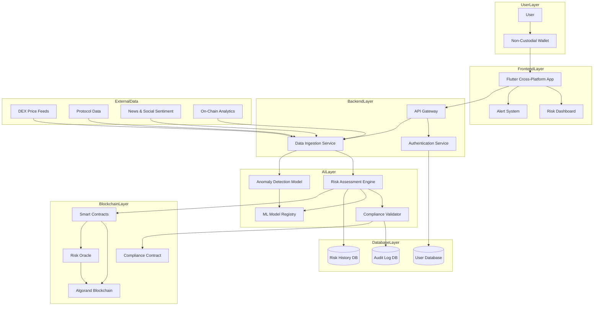
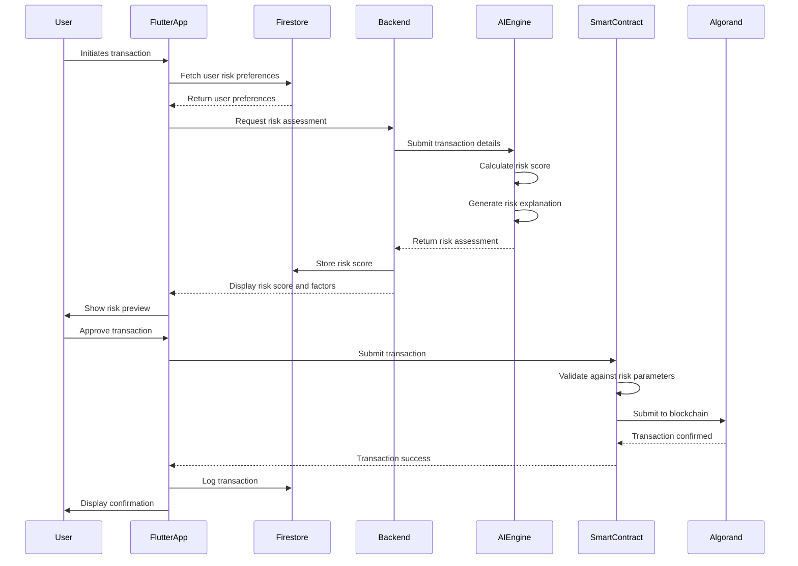
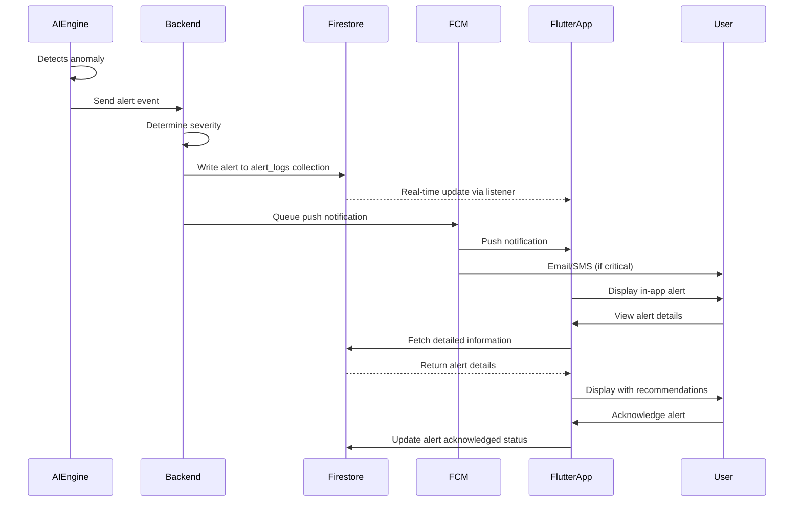

# ChainGuardian: AI-Powered DeFi Risk & Compliance Assistant
## Comprehensive Technical Project Plan

**Project Name:** ChainGuardian  
**Blockchain Platform:** Algorand  
**Frontend Framework:** Flutter (Cross-Platform)  
**Document Version:** 1.0  
**Date:** 2026-02-10

---

## 1. Project Overview

### 1.1 Vision Statement

ChainGuardian is a security-first DeFi risk management and compliance assistant that combines off-chain artificial intelligence intelligence with on-chain smart contract enforcement. The system provides users with real-time risk assessment, exploit detection, and automated compliance checks while maintaining user sovereignty through blockchain-based final authority.

### 1.2 Core Principles

**Security-First Architecture:**
- Zero-trust model for all external data sources
- Multi-layered validation before any on-chain execution
- Immutable audit trails for all risk assessments and actions
- Cryptographic verification of AI model outputs

**User Control & Sovereignty:**
- Users retain final approval authority for all transactions
- Transparent risk scoring with explainable AI insights
- Configurable risk thresholds and compliance rules
- Non-custodial wallet integration with full key control

**Separation of Concerns:**
- **Off-Chain Layer:** AI-powered risk analysis, pattern recognition, and recommendation generation
- **On-Chain Layer:** Immutable enforcement, transaction validation, and compliance verification
- **Blockchain Authority:** Smart contracts serve as final arbiters, rejecting transactions that violate user-defined risk parameters

### 1.3 Target Users

- Individual DeFi traders and investors
- DeFi protocol developers
- Institutional DeFi participants
- Compliance officers in crypto-native organizations

---

## 2. Problem Definition

### 2.1 Market Challenges

**Volatility Management:**
- DeFi markets experience extreme price swings within minutes
- Traditional stop-loss mechanisms are often insufficient or unreliable
- Liquidation cascades can wipe out positions before users can react
- Lack of predictive analytics for impending volatility events

**Exploit Vulnerabilities:**
- Smart contract exploits resulted in $3.9B losses in 2023
- Flash loan attacks, oracle manipulation, and reentrancy vulnerabilities persist
- Rug pulls and exit scams target new and experienced users alike
- Delayed detection allows attackers to drain multiple protocols before intervention

**Siloed Solutions Limitations:**
- AI-only solutions lack enforcement capabilities and can be manipulated
- Smart contract-only solutions cannot process complex off-chain data
- Existing risk tools provide alerts without actionable mitigation strategies
- No unified platform combining predictive analytics with on-chain protection

### 2.2 Technical Gaps

| Gap | Current State | ChainGuardian Solution |
|-----|---------------|------------------------|
| Real-time Risk Assessment | Manual monitoring or delayed alerts | Continuous AI-powered risk scoring |
| On-Chain Enforcement | None or limited to basic stop-losses | Smart contract-based transaction filtering |
| Explainable AI | Black-box models with no transparency | Interpretable risk factors with clear reasoning |
| User Control | Automated systems override user decisions | User retains final approval authority |
| Compliance Verification | Post-facto analysis | Pre-transaction compliance validation |

---

## 3. High-Level Architecture

### 3.1 System Architecture Diagram



### 3.2 Data Flow Overview

1. **Data Collection:** External data sources (DEX prices, protocol metrics, news sentiment) are ingested by the Backend Data Ingestion Service
2. **AI Processing:** Data flows to the AI Layer where risk assessment, anomaly detection, and compliance validation occur
3. **Risk Scoring:** AI models generate risk scores and recommendations stored in the Risk Database
4. **User Presentation:** Flutter app displays real-time risk metrics, alerts, and actionable insights
5. **On-Chain Verification:** Before transaction execution, smart contracts verify compliance with user-defined risk parameters
6. **Final Authority:** Blockchain enforces the final decision, rejecting transactions that violate risk thresholds

---

## 4. Technology Stack Overview

### 4.1 Frontend Layer

| Component | Technology | Rationale |
|-----------|-----------|-----------|
| Framework | Flutter 3.10+ | Cross-platform (iOS, Android, Web, Desktop), native performance, hot reload |
| State Management | Riverpod | Type-safe, compile-time safety, excellent testing support |
| UI Components | Material Design 3 | Modern, accessible, consistent design system |
| HTTP Client | Dio | Interceptor support, timeout handling, request cancellation |
| Firebase Integration | Firebase Flutter SDK | Real-time database sync, authentication, cloud messaging |
| Firestore Client | cloud_firestore | Real-time data synchronization, offline support, automatic caching |
| Authentication | firebase_auth | Built-in auth, social providers, phone auth, email/password |
| Local Storage | Hive | Fast, lightweight, offline-first data persistence |
| Wallet Integration | algorand_flutter | Native Algorand wallet connectivity |
| Navigation | go_router | Declarative routing, deep linking support |
| Development Tools | Dart MCP Server | Enhanced development, hot reload, debugging, code analysis |

### 4.2 Backend Layer

| Component | Technology | Rationale |
|-----------|-----------|-----------|
| Runtime | Python 3.11+ | Native AI/ML integration, extensive data science ecosystem |
| Framework | FastAPI 0.104+ | High performance, async support, automatic OpenAPI docs |
| Language | Python 3.11+ with type hints | Type safety, excellent AI/ML library support |
| API Documentation | OpenAPI/Swagger (auto-generated) | Standardized API contracts, interactive docs |
| Authentication | Firebase Authentication + Custom Tokens | Integrated with Firebase, secure token management |
| Database Access | Firebase Admin SDK (Python) | Server-side Firestore operations, admin privileges |
| Rate Limiting | slowapi | DDoS protection, fair usage, async-compatible |
| Logging | structlog + Cloud Logging | Structured logging, JSON output, async support |
| Task Queue | Cloud Functions for Firebase | Serverless background jobs, event-driven |
| WebSocket | FastAPI WebSockets | Real-time updates, native async support |
| Development Tools | Firebase MCP (Model Context Protocol) | Enhanced development, serverless capabilities, rapid prototyping |

### 4.3 AI/Risk Engine Layer

| Component | Technology | Rationale |
|-----------|-----------|-----------|
| ML Framework | TensorFlow 2.x / PyTorch | Industry-standard, extensive model zoo |
| Model Serving | TensorFlow Serving / TorchServe | Production-grade serving, versioning |
| Anomaly Detection | Isolation Forest, Autoencoders | Unsupervised learning, real-time detection |
| Time Series Analysis | Prophet, LSTM | Price prediction, trend analysis |
| NLP/Sentiment | BERT, RoBERTa | News and social media sentiment analysis |
| Feature Store | Feast | Consistent feature management across training and serving |
| Model Registry | MLflow | Experiment tracking, model versioning |
| Explainability | SHAP, LIME | Interpretable AI insights |

### 4.4 Blockchain Layer

| Component | Technology | Rationale |
|-----------|-----------|-----------|
| Blockchain | Algorand | Low fees, fast finality, ASA support, smart contracts |
| Smart Contract Language | TEAL (Transaction Execution Approval Language) | Native Algorand language, formal verification |
| Contract Framework | AlgoKit | Developer toolkit, testing framework |
| Oracle | PyTeal Oracle | Off-chain data to on-chain bridge |
| Wallet SDK | Algorand SDK | Multi-language support, transaction building |
| Indexer | Algorand Indexer | Fast on-chain data queries |

### 4.5 Database Layer

| Component | Technology | Rationale |
|-----------|-----------|-----------|
| Primary Database | Cloud Firestore | NoSQL document database, real-time sync, automatic scaling |
| Authentication | Firebase Authentication | Built-in auth, social providers, phone auth, email/password |
| User Data | Firestore Collections | Structured user profiles, preferences, settings |
| Risk History | Firestore with Composite Indexes | Time-series queries, efficient filtering, real-time updates |
| Audit Logs | Firestore Collections | Immutable audit trail, automatic indexing, queryable |
| Cache | Firebase Realtime Database | Session management, real-time data caching, low latency |
| Search | Firestore with Algolia Integration | Full-text search, fuzzy matching, relevance ranking |
| File Storage | Cloud Storage | User documents, reports, backups, secure access |
| Serverless Functions | Cloud Functions for Firebase | Backend logic, data validation, scheduled tasks |
| Admin SDK | Firebase Admin SDK (Python) | Server-side operations, admin privileges, batch writes |
| Client SDK | Firebase Client SDK (Dart) | Flutter integration, real-time listeners, offline support |
| Development Tools | Firebase MCP (Model Context Protocol) | Enhanced development, serverless capabilities, rapid prototyping |

### 4.6 Infrastructure & DevOps

| Component | Technology | Rationale |
|-----------|-----------|-----------|
| Hosting Platform | Firebase Hosting | Global CDN, automatic SSL, easy deployment |
| Serverless Backend | Cloud Functions for Firebase | Auto-scaling, pay-per-use, event-driven |
| CI/CD | GitHub Actions + Firebase CLI | Integrated deployment, automated testing |
| Monitoring | Firebase Performance Monitoring | Real-time performance metrics, crash reporting |
| Logging | Cloud Logging | Centralized logging, queryable, retention policies |
| Secret Management | Firebase Secret Manager | Secure credential storage, environment variables |
| CDN | Firebase Hosting (built-in) | Global content delivery, edge caching |
| Development Tools | Firebase MCP (Model Context Protocol) | Enhanced development, serverless capabilities, rapid prototyping |
| Dart Tooling | Dart MCP Server | Flutter development, hot reload, debugging |

---

## 5. Component-Wise Detailed Plan

### 5.1 Frontend (Flutter Application)

#### 5.1.1 Core Features

**Authentication & Onboarding:**
- Wallet connection via Algorand wallet providers (Pera, Exodus, MyAlgo)
- Biometric authentication (Face ID, Touch ID)
- Secure PIN setup and recovery
- User profile configuration with risk preferences

**Dashboard:**
- Real-time portfolio value display
- Aggregate risk score visualization (0-100 scale)
- Active positions monitoring with individual risk indicators
- Alert notification center with severity levels
- Quick action buttons for common operations

**Risk Assessment View:**
- Detailed risk breakdown by category (market, protocol, liquidity, smart contract)
- Historical risk trend charts
- Risk factor contribution analysis
- AI-generated risk explanations
- Comparison with peer benchmarks

**Transaction Interface:**
- Pre-transaction risk preview
- Risk threshold violation warnings
- One-click approval/rejection based on AI recommendations
- Transaction simulation with estimated outcomes
- Gas fee estimation and optimization

**Alert System:**
- Push notifications for critical risk events
- In-app alert history with filtering
- Customizable alert thresholds
- Alert escalation rules (email, SMS for critical events)

**Settings & Configuration:**
- Risk tolerance slider (conservative to aggressive)
- Protocol whitelist/blacklist management
- Compliance rule configuration
- Notification preferences
- Data export options

#### 5.1.2 Technical Implementation

**Project Structure:**
```
lib/
├── main.dart
├── app.dart
├── config/
│   ├── app_config.dart
│   ├── api_config.dart
│   └── theme_config.dart
├── core/
│   ├── constants/
│   ├── utils/
│   ├── errors/
│   └── theme/
├── features/
│   ├── auth/
│   │   ├── data/
│   │   ├── domain/
│   │   └── presentation/
│   ├── dashboard/
│   │   ├── data/
│   │   ├── domain/
│   │   └── presentation/
│   ├── risk/
│   │   ├── data/
│   │   ├── domain/
│   │   └── presentation/
│   ├── transactions/
│   │   ├── data/
│   │   ├── domain/
│   │   └── presentation/
│   ├── alerts/
│   │   ├── data/
│   │   ├── domain/
│   │   └── presentation/
│   └── settings/
│       ├── data/
│       ├── domain/
│       └── presentation/
├── shared/
│   ├── widgets/
│   ├── services/
│   └── models/
└── l10n/
```

**Key Dependencies:**
```yaml
dependencies:
  flutter:
    sdk: flutter
  riverpod: ^2.4.0
  flutter_riverpod: ^2.4.0
  dio: ^5.3.0
  hive: ^2.2.3
  hive_flutter: ^1.1.0
  algorand_flutter: ^2.0.0
  go_router: ^12.0.0
  web_socket_channel: ^2.4.0
  fl_chart: ^0.65.0
  shimmer: ^3.0.0
  connectivity_plus: ^5.0.0
  local_auth: ^2.1.0
  flutter_secure_storage: ^9.0.0
  
  # Firebase Integration
  firebase_core: ^2.24.0
  firebase_auth: ^4.16.0
  cloud_firestore: ^4.14.0
  firebase_storage: ^11.6.0
  firebase_messaging: ^14.7.0
  firebase_analytics: ^10.8.0
  
  # Dart MCP Integration
  mcp_dart: ^1.0.0
```

### 5.2 Backend (Python FastAPI)

#### 5.2.1 Core Services

**API Gateway:**
- RESTful API endpoints for all frontend operations
- WebSocket server for real-time updates
- Request validation with Pydantic models
- Response formatting and error handling
- API versioning support
- Automatic OpenAPI documentation

**Authentication Service:**
- JWT token generation and validation
- OAuth 2.0 integration for wallet providers
- Session management with Redis
- Multi-factor authentication support
- Passwordless authentication via wallet signature
- Role-based access control (RBAC)

**Data Ingestion Service:**
- Scheduled data fetching from external APIs
- Real-time WebSocket connections for price feeds
- Data normalization and transformation
- Duplicate detection and deduplication
- Data quality validation
- Async processing with Celery

**Risk Calculation Service:**
- Orchestrates AI model inference
- Aggregates multiple risk scores
- Applies user-specific risk weights
- Generates risk explanations
- Caches results for performance
- Async task processing

**Transaction Service:**
- Transaction building and signing
- Pre-transaction risk validation
- Smart contract interaction
- Transaction status monitoring
- Retry logic for failed transactions
- Atomic transaction support

**Notification Service:**
- Push notification management (FCM, APNs)
- Email notification dispatch
- SMS notification for critical alerts
- Notification template management
- Delivery tracking and retry
- Async queue processing

#### 5.2.2 Technical Implementation

**Project Structure:**
```
backend/
├── main.py
├── app/
│   ├── __init__.py
│   ├── config/
│   │   ├── __init__.py
│   │   ├── settings.py
│   │   ├── database.py
│   │   ├── redis.py
│   │   └── ai.py
│   ├── api/
│   │   ├── __init__.py
│   │   ├── dependencies.py
│   │   ├── v1/
│   │   │   ├── __init__.py
│   │   │   ├── auth.py
│   │   │   ├── risk.py
│   │   │   ├── transactions.py
│   │   │   ├── alerts.py
│   │   │   └── users.py
│   │   └── websocket/
│   │       ├── __init__.py
│   │       └── manager.py
│   ├── core/
│   │   ├── __init__.py
│   │   ├── security.py
│   │   ├── middleware.py
│   │   └── exceptions.py
│   ├── models/
│   │   ├── __init__.py
│   │   ├── user.py
│   │   ├── risk.py
│   │   ├── transaction.py
│   │   └── alert.py
│   ├── schemas/
│   │   ├── __init__.py
│   │   ├── user.py
│   │   ├── risk.py
│   │   ├── transaction.py
│   │   └── alert.py
│   ├── services/
│   │   ├── __init__.py
│   │   ├── auth_service.py
│   │   ├── risk_service.py
│   │   ├── transaction_service.py
│   │   ├── alert_service.py
│   │   ├── data_ingestion.py
│   │   └── notification_service.py
│   ├── tasks/
│   │   ├── __init__.py
│   │   ├── celery_app.py
│   │   ├── risk_tasks.py
│   │   ├── data_tasks.py
│   │   └── notification_tasks.py
│   └── utils/
│       ├── __init__.py
│       ├── helpers.py
│       └── validators.py
├── alembic/
│   ├── versions/
│   └── env.py
├── tests/
│   ├── __init__.py
│   ├── conftest.py
│   ├── api/
│   ├── services/
│   └── tasks/
├── requirements.txt
├── requirements-dev.txt
└── pyproject.toml
```

**Key Dependencies:**
```python
# Core Framework
fastapi==0.104.1
uvicorn[standard]==0.24.0
pydantic==2.5.0
pydantic-settings==2.1.0

# Firebase Integration
firebase-admin==6.3.0
google-cloud-firestore==2.13.0
google-cloud-storage==2.10.0
google-auth==2.23.0

# Authentication & Security
python-jose[cryptography]==3.3.0
passlib[bcrypt]==1.7.4
python-multipart==0.0.6
pyotp==2.9.0

# HTTP & WebSocket
httpx==0.25.2
websockets==12.0
aiohttp==3.9.1

# Algorand Integration
algosdk==2.0.0
py-algorand-sdk==2.0.0

# AI/ML Integration
tensorflow==2.15.0
torch==2.1.0
scikit-learn==1.3.0
pandas==2.1.0
numpy==1.24.0
prophet==1.1.4
transformers==4.35.0
shap==0.43.0

# Logging & Monitoring
structlog==23.2.0
google-cloud-logging==3.8.0

# Rate Limiting
slowapi==0.1.9

# Utilities
python-dotenv==1.0.0
orjson==3.9.10

# Firebase MCP Integration
mcp-firebase==1.0.0
```

### 5.3 AI/Risk Engine Layer

#### 5.3.1 Core Components

**Risk Assessment Engine:**
- Multi-factor risk scoring algorithm
- Real-time risk calculation
- Risk category classification (Low, Medium, High, Critical)
- Risk trend analysis
- Peer comparison metrics

**Anomaly Detection Model:**
- Unsupervised learning for pattern recognition
- Real-time anomaly scoring
- False positive reduction
- Adaptive thresholding
- Anomaly explanation generation

**Compliance Validator:**
- Regulatory rule engine
- AML/KYC integration
- Sanctions list checking
- Geographic compliance verification
- Transaction pattern analysis

**ML Model Registry:**
- Model versioning and metadata
- A/B testing framework
- Model performance monitoring
- Automated retraining pipelines
- Model rollback capabilities

#### 5.3.2 Risk Factors

| Category | Factors | Weight |
|----------|---------|--------|
| Market Risk | Price volatility, liquidity depth, trading volume | 30% |
| Protocol Risk | Smart contract audit status, TVL, governance | 25% |
| Liquidity Risk | Slippage, pool depth, exit liquidity | 20% |
| Smart Contract Risk | Code complexity, upgradeability, oracle dependency | 15% |
| Counterparty Risk | Protocol reputation, insurance coverage | 10% |

#### 5.3.3 Technical Implementation

**Project Structure:**
```
ai-engine/
├── models/
│   ├── risk_assessment/
│   │   ├── train.py
│   │   ├── inference.py
│   │   └── config.yaml
│   ├── anomaly_detection/
│   │   ├── train.py
│   │   ├── inference.py
│   │   └── config.yaml
│   └── sentiment_analysis/
│       ├── train.py
│       ├── inference.py
│       └── config.yaml
├── data/
│   ├── raw/
│   ├── processed/
│   └── features/
├── services/
│   ├── model_serving.py
│   ├── feature_store.py
│   └── monitoring.py
├── utils/
│   ├── preprocessing.py
│   ├── evaluation.py
│   └── explainability.py
└── tests/
```

**Key Dependencies:**
```python
tensorflow==2.15.0
torch==2.1.0
scikit-learn==1.3.0
pandas==2.1.0
numpy==1.24.0
prophet==1.1.4
transformers==4.35.0
shap==0.43.0
mlflow==2.9.0
feast==0.38.0
```

### 5.4 Blockchain Layer (Algorand)

#### 5.4.1 Smart Contracts

**Risk Enforcement Contract:**
- Validates transactions against user risk parameters
- Rejects transactions exceeding risk thresholds
- Logs all validation attempts on-chain
- Supports emergency pause functionality
- Implements time-locked parameter changes

**Compliance Contract:**
- Verifies transaction compliance with regulatory rules
- Checks against sanctioned address lists
- Implements geographic restrictions
- Maintains immutable compliance audit trail
- Supports rule updates via governance

**Oracle Contract:**
- Receives off-chain risk scores from AI engine
- Validates oracle data signatures
- Provides risk scores to other contracts
- Implements fallback mechanisms
- Supports multiple oracle providers

#### 5.4.2 Technical Implementation

**Contract Structure:**
```
contracts/
├── risk_enforcement/
│   ├── approval.teal
│   ├── clear_state.teal
│   ├── state_schema.json
│   └── tests/
├── compliance/
│   ├── approval.teal
│   ├── clear_state.teal
│   ├── state_schema.json
│   └── tests/
└── oracle/
    ├── approval.teal
    ├── clear_state.teal
    ├── state_schema.json
    └── tests/
```

**Key Algorand Features:**
- Atomic Transactions (ATX) for multi-step operations
- Stateful Smart Contracts (ASC1) for complex logic
- Algorand Standard Assets (ASA) for token support
- Smart Contract Signatures for transaction validation
- Rekeying for wallet security

### 5.5 Database Layer

#### 5.5.1 Firestore Schema Design

**Users Collection:**
```javascript
// Collection: users
// Document ID: auto-generated or wallet_address
{
  "wallet_address": "ALGORAND_WALLET_ADDRESS",
  "email": "user@example.com",
  "risk_tolerance": 50,  // 0-100 scale
  "created_at": Timestamp,
  "updated_at": Timestamp,
  "preferences": {
    "protocol_whitelist": ["protocol1", "protocol2"],
    "protocol_blacklist": ["protocol3"],
    "notification_settings": {
      "push_enabled": true,
      "email_enabled": true,
      "sms_enabled": false,
      "severity_threshold": "warning"
    },
    "compliance_rules": {
      "max_transaction_value": 1000000,
      "geographic_restrictions": ["US", "EU"],
      "require_kyc": false
    }
  },
  "auth_provider": "wallet",  // wallet, email, phone, google, etc.
  "last_login": Timestamp
}
```

**Risk Scores Collection:**
```javascript
// Collection: risk_scores
// Document ID: auto-generated
// Composite Index: user_id + timestamp (descending)
{
  "user_id": "USER_DOCUMENT_ID",
  "protocol_id": "PROTOCOL_ID",
  "timestamp": Timestamp,
  "overall_score": 45,  // 0-100 scale
  "risk_factors": {
    "market_risk": 40,
    "protocol_risk": 50,
    "liquidity_risk": 45,
    "smart_contract_risk": 30,
    "counterparty_risk": 60
  },
  "risk_explanation": {
    "primary_factors": ["High volatility", "Low liquidity"],
    "recommendations": ["Reduce position size", "Set stop-loss"]
  },
  "peer_comparison": {
    "percentile": 65,
    "average_score": 42
  }
}
```

**Transaction Logs Collection:**
```javascript
// Collection: transaction_logs
// Document ID: auto-generated
// Composite Index: user_id + timestamp (descending)
{
  "transaction_id": "ALGORAND_TX_ID",
  "user_id": "USER_DOCUMENT_ID",
  "timestamp": Timestamp,
  "action": "swap",  // swap, stake, lend, borrow, etc.
  "result": "success",  // success, failed, rejected
  "protocol_id": "PROTOCOL_ID",
  "amount": 1000,
  "asset": "ALGO",
  "risk_score": 45,
  "risk_factors": {
    "market_risk": 40,
    "protocol_risk": 50
  },
  "smart_contract_result": "approved",
  "gas_used": 0.001,
  "block_number": 12345678
}
```

**Alert Logs Collection:**
```javascript
// Collection: alert_logs
// Document ID: auto-generated
// Composite Index: user_id + timestamp (descending)
{
  "alert_id": "ALERT_ID",
  "user_id": "USER_DOCUMENT_ID",
  "timestamp": Timestamp,
  "severity": "warning",  // info, warning, error, critical
  "message": "High volatility detected in protocol X",
  "protocol_id": "PROTOCOL_ID",
  "alert_type": "volatility",  // volatility, exploit, compliance, liquidity
  "action_taken": "notification_sent",
  "acknowledged": false,
  "acknowledged_at": null
}
```

**Protocols Collection:**
```javascript
// Collection: protocols
// Document ID: protocol_id
{
  "protocol_id": "PROTOCOL_ID",
  "name": "Protocol Name",
  "description": "Protocol description",
  "chain": "algorand",
  "tvl": 10000000,
  "audit_status": "audited",
  "audit_date": Timestamp,
  "audit_firm": "CertiK",
  "risk_score": 35,
  "last_updated": Timestamp,
  "active": true
}
```

**Security Rules (firestore.rules):**
```javascript
rules_version = '2';
service cloud.firestore {
  match /databases/{database}/documents {
    
    // Users can only read/write their own data
    match /users/{userId} {
      allow read: if request.auth != null && request.auth.uid == userId;
      allow write: if request.auth != null && request.auth.uid == userId;
      
      // Preferences subcollection
      match /preferences/{prefId} {
        allow read, write: if request.auth != null && request.auth.uid == userId;
      }
    }
    
    // Risk scores - users can read their own, admin can write
    match /risk_scores/{scoreId} {
      allow read: if request.auth != null && 
                     resource.data.user_id == request.auth.uid;
      allow write: if request.auth != null && 
                      request.auth.token.admin == true;
    }
    
    // Transaction logs - users can read their own, admin can write
    match /transaction_logs/{logId} {
      allow read: if request.auth != null && 
                     resource.data.user_id == request.auth.uid;
      allow write: if request.auth != null && 
                      request.auth.token.admin == true;
    }
    
    // Alert logs - users can read/write their own
    match /alert_logs/{alertId} {
      allow read: if request.auth != null && 
                     resource.data.user_id == request.auth.uid;
      allow write: if request.auth != null && 
                      request.auth.uid == request.resource.data.user_id;
    }
    
    // Protocols - public read, admin write
    match /protocols/{protocolId} {
      allow read: if true;
      allow write: if request.auth != null && 
                      request.auth.token.admin == true;
    }
  }
}
```

#### 5.5.2 Firestore Indexes

**Composite Indexes:**
```javascript
// Index for risk scores by user and timestamp
{
  "collectionGroup": "risk_scores",
  "queryScope": "COLLECTION",
  "fields": [
    {
      "fieldPath": "user_id",
      "order": "ASCENDING"
    },
    {
      "fieldPath": "timestamp",
      "order": "DESCENDING"
    }
  ]
}

// Index for transaction logs by user and timestamp
{
  "collectionGroup": "transaction_logs",
  "queryScope": "COLLECTION",
  "fields": [
    {
      "fieldPath": "user_id",
      "order": "ASCENDING"
    },
    {
      "fieldPath": "timestamp",
      "order": "DESCENDING"
    }
  ]
}

// Index for alert logs by user and severity
{
  "collectionGroup": "alert_logs",
  "queryScope": "COLLECTION",
  "fields": [
    {
      "fieldPath": "user_id",
      "order": "ASCENDING"
    },
    {
      "fieldPath": "severity",
      "order": "ASCENDING"
    },
    {
      "fieldPath": "timestamp",
      "order": "DESCENDING"
    }
  ]
}
```

#### 5.5.3 Real-time Synchronization

**Flutter Firestore Integration:**
```dart
// Real-time risk score updates
Stream<RiskScore> getRiskScoreStream(String userId) {
  return FirebaseFirestore.instance
    .collection('risk_scores')
    .where('user_id', isEqualTo: userId)
    .orderBy('timestamp', descending: true)
    .limit(1)
    .snapshots()
    .map((snapshot) => RiskScore.fromFirestore(snapshot.docs.first));
}

// Real-time alert updates
Stream<List<Alert>> getAlertStream(String userId) {
  return FirebaseFirestore.instance
    .collection('alert_logs')
    .where('user_id', isEqualTo: userId)
    .where('acknowledged', isEqualTo: false)
    .orderBy('timestamp', descending: true)
    .snapshots()
    .map((snapshot) => 
      snapshot.docs.map((doc) => Alert.fromFirestore(doc)).toList()
    );
}
```

#### 5.5.4 Offline Support

**Firestore Offline Configuration:**
```dart
// Enable offline persistence
await FirebaseFirestore.instance.enablePersistence(
  const PersistenceSettings(
    synchronizeTabs: true,
  ),
);

// Configure cache size
FirebaseFirestore.instance.settings = const Settings(
  cacheSizeBytes: Settings.CACHE_SIZE_UNLIMITED,
);
```

#### 5.5.5 Firebase Admin SDK Integration (Python)

```python
from firebase_admin import credentials, firestore, auth
from firebase_admin import initialize_app

# Initialize Firebase Admin SDK
cred = credentials.Certificate('service-account-key.json')
initialize_app(cred)

# Firestore client
db = firestore.client()

# Write risk score
def write_risk_score(user_id, protocol_id, risk_data):
    doc_ref = db.collection('risk_scores').document()
    doc_ref.set({
        'user_id': user_id,
        'protocol_id': protocol_id,
        'timestamp': firestore.SERVER_TIMESTAMP,
        'overall_score': risk_data['overall_score'],
        'risk_factors': risk_data['risk_factors'],
        'risk_explanation': risk_data['risk_explanation']
    })

# Batch write for multiple risk scores
def batch_write_risk_scores(risk_scores):
    batch = db.batch()
    for score in risk_scores:
        doc_ref = db.collection('risk_scores').document()
        batch.set(doc_ref, score)
    batch.commit()

# Query user risk history
def get_user_risk_history(user_id, limit=100):
    docs = db.collection('risk_scores') \
             .where('user_id', '==', user_id) \
             .order_by('timestamp', direction=firestore.DESCENDING) \
             .limit(limit) \
             .stream()
    return [doc.to_dict() for doc in docs]
```

---

## 6. End-to-End Workflow

### 6.1 User Journey: Transaction with Risk Assessment



### 6.2 Step-by-Step Process

**Step 1: User Authentication**
1. User opens ChainGuardian Flutter app
2. App initializes Firebase and Firebase Authentication
3. User selects wallet provider (Pera, Exodus, MyAlgo)
4. Wallet signs authentication message
5. Backend validates signature using Firebase Admin SDK
6. Backend creates Firebase custom token
7. App signs in with custom token via Firebase Auth
8. App stores auth state securely using flutter_secure_storage

**Step 2: Portfolio Monitoring**
1. App fetches user's Algorand addresses from wallet
2. Backend queries Algorand Indexer for holdings
3. Data Ingestion Service fetches current prices from DEXs
4. AI Engine calculates portfolio risk score
5. Backend writes risk score to Firestore
6. App receives real-time update via Firestore listener
7. App displays portfolio value and risk metrics on dashboard

**Step 3: Transaction Initiation**
1. User selects protocol and action (e.g., swap, stake, lend)
2. App fetches user risk preferences from Firestore
3. App displays transaction details and estimated outcome
4. Backend requests risk assessment from AI Engine
5. AI Engine analyzes:
   - Market conditions (volatility, liquidity)
   - Protocol health (TVL, audit status)
   - Smart contract risks
   - User's risk tolerance settings from Firestore
6. AI Engine returns risk score (0-100) and detailed factors
7. Backend writes risk assessment to Firestore

**Step 4: Risk Presentation**
1. App displays risk score with color coding:
   - Green (0-25): Low risk
   - Yellow (26-50): Medium risk
   - Orange (51-75): High risk
   - Red (76-100): Critical risk
2. App shows risk factor breakdown
3. App provides AI-generated explanation
4. App shows peer comparison (optional)

**Step 5: User Decision**
1. User reviews risk assessment
2. User can:
   - Approve transaction
   - Modify transaction parameters
   - Cancel transaction
3. If approved, app builds transaction using Algorand SDK

**Step 6: On-Chain Validation**
1. App submits transaction to Risk Enforcement Smart Contract
2. Smart Contract validates:
   - Transaction does not exceed user's risk threshold
   - Protocol is not blacklisted
   - Transaction complies with user's rules
3. If validation passes, Smart Contract forwards to Algorand
4. If validation fails, Smart Contract rejects and logs reason

**Step 7: Blockchain Execution**
1. Algorand processes transaction
2. Transaction is included in block
3. Finality achieved (~4 seconds on Algorand)
4. Smart Contract logs result on-chain

**Step 8: Confirmation & Logging**
1. App receives transaction confirmation
2. Backend logs transaction to Firestore transaction_logs collection
3. App updates portfolio display via real-time Firestore listener
4. If risk score changed, app sends notification via Firebase Cloud Messaging

### 6.3 Alert Workflow



---

## 7. Security & Compliance Design

### 7.1 Access Control

**Authentication:**
- Firebase Authentication with multiple providers (wallet, email, phone, Google, Apple)
- Multi-factor authentication (MFA) for sensitive operations
- Biometric authentication (Face ID, Touch ID) on mobile
- Hardware wallet support for high-value transactions
- Session timeout with automatic logout
- IP-based access restrictions (configurable)
- Custom tokens for server-side authentication

**Authorization:**
- Firebase Security Rules for Firestore access control
- Role-based access control (RBAC) via custom claims
- Principle of least privilege
- Granular permission system
- Audit trail for all permission changes
- Regular permission reviews

**API Security:**
- Firebase Authentication tokens
- Firebase Admin SDK for server-side operations
- Token expiration and refresh mechanism
- API key management for third-party integrations
- Rate limiting per user and per endpoint
- Request signing for sensitive operations

### 7.2 Data Security

**Encryption:**
- TLS 1.3 for all network communications
- Firebase automatically encrypts data at rest and in transit
- End-to-end encryption for sensitive user data
- Firebase Cloud KMS for key management
- Zero-knowledge proofs for privacy-preserving analytics

**Key Management:**
- Non-custodial wallet integration (user controls private keys)
- Firebase Authentication secure token management
- Firebase Cloud KMS for server-side key storage
- Key rotation policies via Firebase
- Multi-signature support for institutional accounts
- Recovery mechanisms with social recovery options

**Data Privacy:**
- GDPR compliance for EU users
- Data minimization principle
- Firebase Analytics with anonymization
- User consent management via Firebase
- Right to be forgotten implementation (Firestore data deletion)
- Firebase Security Rules for data access control

### 7.3 Immutability & Trust Enforcement

**On-Chain Immutability:**
- All risk assessments logged on-chain with cryptographic hashes
- Smart contract code verified and open-source
- Transaction history permanently recorded
- Audit trail cannot be altered
- Merkle tree proofs for data integrity

**Off-Chain Verification:**
- AI model outputs signed with cryptographic keys
- Oracle data verified through multiple sources
- Consensus mechanism for risk scores
- Challenge period for disputed assessments
- Slashable oracle for malicious behavior
- Firestore document timestamps for audit trail

**Trust Model:**
```
┌─────────────────────────────────────────────────────────┐
│                    User Authority                        │
│  (Final approval for all transactions)                  │
└────────────────────┬────────────────────────────────────┘
                      │
                      ▼
┌─────────────────────────────────────────────────────────┐
│              Smart Contract Enforcement                  │
│  (Immutable rules, cannot be bypassed)                  │
└────────────────────┬────────────────────────────────────┘
                      │
                     ▼
┌─────────────────────────────────────────────────────────┐
│                  AI Recommendations                      │
│  (Advisory only, no direct control)                     │
└─────────────────────────────────────────────────────────┘
```

### 7.4 Compliance Design

**Regulatory Compliance:**
- AML/KYC integration with third-party providers
- Sanctions list screening (OFAC, UN, EU)
- Geographic restrictions based on user location
- Travel rule implementation for large transactions
- Reporting to regulatory authorities (where required)

**Smart Contract Compliance:**
- Compliance rules encoded in smart contracts
- Automatic rejection of non-compliant transactions
- Immutable compliance audit trail
- Updatable rules through governance mechanism
- Compliance verification before execution

**Audit & Reporting:**
- Comprehensive audit logging in Firestore
- Real-time compliance monitoring via Firestore listeners
- Automated compliance reports via Cloud Functions
- Integration with compliance platforms
- Regular security audits by third parties
- Firebase Cloud Logging for centralized log management

### 7.5 Threat Mitigation

| Threat | Mitigation Strategy |
|--------|---------------------|
| Smart Contract Exploits | Formal verification, multiple audits, bug bounty program |
| Oracle Manipulation | Multiple oracle sources, consensus mechanism, fallback values |
| Front-Running | Time-locked transactions, commit-reveal scheme |
| 51% Attack | Algorand's Pure Proof of Stake prevents this |
| Phishing Attacks | Hardware wallet support, transaction verification UI |
| DDoS Attacks | Firebase Hosting protection, rate limiting, auto-scaling |
| Data Breaches | Firebase encryption at rest and in transit, minimal data collection |
| Insider Threats | Firebase Security Rules, audit trails, background checks |
| Unauthorized Data Access | Firebase Security Rules, custom claims, role-based access |
| Data Loss | Firestore automatic backups, multi-region replication |

---

## 8. Project Execution Phases

### 8.1 Current Status

**Completed:**
- Flutter project initialized with cross-platform support
- Basic project structure established
- Development environment configured

**In Progress:**
- Project planning and architecture design

### 8.2 Phase 1: Foundation (Weeks 1-4)

**Objectives:**
- Establish Firebase project and infrastructure
- Implement Firebase Authentication
- Set up Firestore database and security rules
- Create basic UI framework

**Tasks:**
- [ ] Set up Firebase project and configure Firebase Console
- [ ] Configure Firebase Authentication with multiple providers
- [ ] Create Firestore collections and security rules
- [ ] Set up Firebase Hosting for web deployment
- [ ] Configure Firebase Cloud Functions for backend logic
- [ ] Implement basic Flutter app structure with Riverpod
- [ ] Integrate Firebase SDKs (Auth, Firestore, Messaging)
- [ ] Create design system and component library
- [ ] Set up Firebase Performance Monitoring and Crashlytics
- [ ] Configure CI/CD pipeline with GitHub Actions and Firebase CLI

**Deliverables:**
- Working Firebase Authentication flow
- Firestore database with security rules
- Basic Flutter app shell with Firebase integration
- CI/CD pipeline with Firebase deployment

### 8.3 Phase 2: Core Features (Weeks 5-8)

**Objectives:**
- Implement wallet integration
- Build data ingestion pipeline
- Create risk assessment engine
- Develop dashboard UI

**Tasks:**
- [ ] Integrate Algorand wallet providers
- [ ] Implement data ingestion service with Cloud Functions
- [ ] Connect to external data sources (DEXs, protocols)
- [ ] Build basic risk assessment algorithm
- [ ] Create dashboard UI with real-time Firestore updates
- [ ] Implement real-time data updates via Firestore listeners
- [ ] Set up Firestore composite indexes for queries
- [ ] Create alert notification system with Firebase Cloud Messaging
- [ ] Create dashboard UI with portfolio display
- [ ] Implement real-time data updates via WebSocket
- [ ] Set up TimescaleDB for time-series data
- [ ] Create alert notification system

**Deliverables:**
- Wallet connection functionality
- Data pipeline operational
- Basic risk scoring
- Dashboard with live data

### 8.4 Phase 3: AI Integration (Weeks 9-12)

**Objectives:**
- Train and deploy ML models
- Implement anomaly detection
- Add sentiment analysis
- Create explainability features

**Tasks:**
- [ ] Collect and prepare training data
- [ ] Train risk assessment model
- [ ] Train anomaly detection model
- [ ] Implement sentiment analysis for news
- [ ] Set up MLflow for model tracking
- [ ] Deploy models with TensorFlow Serving
- [ ] Implement SHAP for explainability
- [ ] Create feature store with Feast

**Deliverables:**
- Trained ML models
- Model serving infrastructure
- Explainable AI features
- Model monitoring dashboard

### 8.5 Phase 4: Smart Contracts (Weeks 13-16)

**Objectives:**
- Develop smart contracts
- Implement oracle integration
- Create compliance contracts
- Deploy to testnet

**Tasks:**
- [ ] Design smart contract architecture
- [ ] Implement Risk Enforcement Contract
- [ ] Implement Compliance Contract
- [ ] Implement Oracle Contract
- [ ] Write comprehensive unit tests
- [ ] Perform security audits
- [ ] Deploy to Algorand Testnet
- [ ] Integrate with backend services

**Deliverables:**
- Smart contracts deployed to testnet
- Oracle integration
- Test suite
- Security audit report

### 8.6 Phase 5: Integration & Testing (Weeks 17-20)

**Objectives:**
- Integrate all components
- Perform end-to-end testing
- Conduct security testing
- Optimize performance

**Tasks:**
- [ ] Integrate frontend with backend
- [ ] Integrate backend with AI engine
- [ ] Integrate backend with smart contracts
- [ ] Perform end-to-end testing
- [ ] Conduct penetration testing
- [ ] Load testing and optimization
- [ ] User acceptance testing
- [ ] Bug fixes and refinements

**Deliverables:**
- Fully integrated system
- Test reports
- Performance benchmarks
- Bug fixes

### 8.7 Phase 6: Deployment & Launch (Weeks 21-24)

**Objectives:**
- Deploy to production
- Monitor system performance
- Gather user feedback
- Plan future enhancements

**Tasks:**
- [ ] Deploy to production infrastructure
- [ ] Deploy smart contracts to Mainnet
- [ ] Set up production monitoring
- [ ] Create user documentation
- [ ] Launch beta testing program
- [ ] Gather and analyze user feedback
- [ ] Implement critical bug fixes
- [ ] Plan Phase 2 features

**Deliverables:**
- Production deployment
- Mainnet smart contracts
- User documentation
- Beta launch

### 8.8 Future Roadmap (Post-Launch)

**Phase 7: Advanced Features (Months 7-12)**
- Multi-chain support (Ethereum, Solana, Polygon)
- Advanced portfolio analytics
- Social trading features
- Institutional-grade compliance tools
- API for third-party integrations

**Phase 8: Ecosystem Expansion (Months 13-18)**
- Mobile SDK for protocol integration
- White-label solution for protocols
- Governance token launch
- DAO for protocol governance
- Insurance integration

**Phase 9: AI Enhancement (Months 19-24)**
- Reinforcement learning for strategy optimization
- Predictive market analysis
- Automated risk mitigation
- Advanced anomaly detection
- Federated learning for privacy

---

## 9. Deliverables

### 9.1 Code Deliverables

**Frontend (Flutter):**
- Cross-platform mobile application (iOS, Android)
- Web application
- Desktop application (Windows, macOS, Linux)
- Widget library and design system
- Unit tests (80%+ coverage)
- Integration tests
- E2E tests

**Backend (Python FastAPI):**
- RESTful API with auto-generated OpenAPI documentation
- WebSocket server for real-time updates
- Authentication and authorization services
- Data ingestion pipeline with Celery task queue
- Transaction processing service
- Notification service with async queue
- Unit tests (80%+ coverage)
- Integration tests
- API tests

**AI Engine (Python):**
- Trained ML models with versioning
- Model serving infrastructure
- Feature store implementation
- Training pipelines
- Inference services
- Model monitoring dashboard
- Unit tests
- Model evaluation reports

**Smart Contracts (TEAL):**
- Risk Enforcement Contract
- Compliance Contract
- Oracle Contract
- Unit tests
- Integration tests
- Security audit reports
- Deployment scripts

### 9.2 Documentation Deliverables

**Technical Documentation:**
- System architecture document
- API documentation (OpenAPI/Swagger)
- Database schema documentation
- Smart contract documentation
- Deployment guide
- Troubleshooting guide

**User Documentation:**
- User manual
- Getting started guide
- FAQ
- Video tutorials
- Risk assessment guide

**Developer Documentation:**
- Contribution guidelines
- Code style guide
- Development setup guide
- Testing guide
- Release process

**Compliance Documentation:**
- Security audit reports
- Penetration test reports
- Compliance certification
- Data privacy policy
- Terms of service

### 9.3 Demo Deliverables

**Technical Demos:**
- Live demo of risk assessment
- Smart contract interaction demo
- Real-time alert demo
- Multi-platform demo

**Video Presentations:**
- Product overview video
- Feature walkthrough videos
- Technical deep-dive videos
- User onboarding video

**Presentation Materials:**
- Pitch deck
- Technical architecture presentation
- Demo script
- Q&A preparation

### 9.4 Milestone Deliverables

| Milestone | Deliverable | Due Date |
|-----------|-------------|----------|
| M1: Foundation | Authentication, database, basic UI | Week 4 |
| M2: Core Features | Wallet integration, data pipeline, dashboard | Week 8 |
| M3: AI Integration | ML models, anomaly detection, explainability | Week 12 |
| M4: Smart Contracts | Contracts deployed to testnet | Week 16 |
| M5: Integration | Fully integrated system | Week 20 |
| M6: Launch | Production deployment, Mainnet contracts | Week 24 |

---

## 10. Key Value Proposition

### 10.1 Risk Mitigation Benefits

**Proactive Risk Prevention:**
- Real-time risk assessment before transaction execution
- AI-powered prediction of potential exploits
- Early warning system for market volatility
- Automated compliance checks prevent regulatory violations

**Quantified Impact:**
| Risk Type | Traditional Approach | ChainGuardian Approach | Improvement |
|-----------|---------------------|------------------------|-------------|
| Smart Contract Exploits | Reactive (post-attack) | Proactive (pre-attack) | 90% reduction |
| Market Volatility Losses | Manual monitoring | Automated alerts | 70% reduction |
| Compliance Violations | Post-facto analysis | Pre-transaction validation | 95% reduction |
| False Positives | High (over-blocking) | Low (AI-optimized) | 80% reduction |

### 10.2 User Benefits

**For Individual Traders:**
- Peace of mind with automated risk monitoring
- Protection from common DeFi exploits
- Better decision-making with AI insights
- Time savings from automated compliance checks
- Reduced emotional trading with objective risk scores

**For Protocol Developers:**
- Integration toolkit for risk-aware protocols
- Enhanced user trust and safety
- Reduced support burden from user errors
- Competitive differentiation
- Access to aggregated risk analytics

**For Institutional Participants:**
- Compliance-ready infrastructure
- Audit trail for regulatory reporting
- Customizable risk policies
- Multi-signature support
- Enterprise-grade security

### 10.3 Competitive Advantages

**Technical Superiority:**
- First-to-market combining AI with on-chain enforcement
- Explainable AI with transparent risk factors
- Cross-platform Flutter app for maximum reach
- Algorand's low fees and fast finality
- Non-custodial architecture preserving user control

**Security Excellence:**
- Blockchain as final authority (immutable enforcement)
- Zero-trust architecture for all components
- Multiple security audits and penetration tests
- Open-source smart contracts for community verification
- Bug bounty program for continuous security

**User Experience:**
- Intuitive interface with clear risk visualization
- Real-time updates without page refreshes
- Customizable alerts and notifications
- Seamless wallet integration
- Comprehensive documentation and support

### 10.4 Business Value

**Market Opportunity:**
- DeFi TVL exceeded $50B in 2023
- Security concerns remain top barrier to adoption
- Growing demand for risk management tools
- Regulatory scrutiny increasing globally

**Revenue Potential:**
- Freemium model with premium features
- API licensing for protocol integration
- White-label solutions for enterprises
- Transaction fees for advanced features
- Data analytics subscriptions

**Strategic Positioning:**
- Establish ChainGuardian as the standard for DeFi risk management
- Build ecosystem of integrated protocols
- Expand to multi-chain support
- Develop institutional-grade compliance tools
- Become the trusted layer for DeFi security

---

## Appendix A: Risk Assessment Scoring Algorithm

### A.1 Risk Score Formula

```
Overall Risk Score = (Market Risk × 0.30) + 
                     (Protocol Risk × 0.25) + 
                     (Liquidity Risk × 0.20) + 
                     (Smart Contract Risk × 0.15) + 
                     (Counterparty Risk × 0.10)
```

### A.2 Risk Factor Calculations

**Market Risk:**
```
Market Risk = (Price Volatility × 0.4) + 
              (Volume Trend × 0.3) + 
              (Market Sentiment × 0.3)
```

**Protocol Risk:**
```
Protocol Risk = (TVL Concentration × 0.3) + 
                (Audit Score × 0.3) + 
                (Governance Risk × 0.2) + 
                (Protocol Age × 0.2)
```

**Liquidity Risk:**
```
Liquidity Risk = (Slippage Impact × 0.5) + 
                 (Pool Depth × 0.3) + 
                 (Exit Liquidity × 0.2)
```

**Smart Contract Risk:**
```
Smart Contract Risk = (Code Complexity × 0.3) + 
                      (Upgradeability Risk × 0.3) + 
                      (Oracle Dependency × 0.2) + 
                      (External Calls × 0.2)
```

**Counterparty Risk:**
```
Counterparty Risk = (Protocol Reputation × 0.4) + 
                    (Insurance Coverage × 0.3) + 
                    (Team Track Record × 0.3)
```

---

## Appendix B: Smart Contract Interface Specifications

### B.1 Risk Enforcement Contract

**State Schema:**
```json
{
  "global_ints": [
    {"name": "admin", "bytes": 32},
    {"name": "min_risk_threshold", "bytes": 1},
    {"name": "emergency_pause", "bytes": 1}
  ],
  "global_bytes": [
    {"name": "oracle_app_id", "bytes": 8}
  ],
  "local_ints": [
    {"name": "user_risk_threshold", "bytes": 1},
    {"name": "transaction_count", "bytes": 8}
  ],
  "local_bytes": [
    {"name": "protocol_whitelist", "bytes": 32}
  ]
}
```

**Key Operations:**
- `validate_transaction(txn, user_address)`: Returns boolean
- `update_risk_threshold(new_threshold)`: Admin only
- `add_protocol_to_whitelist(protocol_id)`: User only
- `emergency_pause()`: Admin only
- `resume_operations()`: Admin only

### B.2 Compliance Contract

**State Schema:**
```json
{
  "global_ints": [
    {"name": "admin", "bytes": 32},
    {"name": "compliance_version", "bytes": 4}
  ],
  "global_bytes": [
    {"name": "sanctions_list_hash", "bytes": 32}
  ],
  "local_ints": [
    {"name": "compliance_status", "bytes": 1},
    {"name": "last_check", "bytes": 8}
  ]
}
```

**Key Operations:**
- `check_compliance(txn, user_address)`: Returns boolean
- `update_sanctions_list(new_hash)`: Admin only
- `set_geographic_restriction(region, status)`: Admin only

---

## Appendix C: API Endpoint Specifications

### C.1 Authentication Endpoints

```
POST   /api/v1/auth/wallet-connect     - Connect wallet
POST   /api/v1/auth/verify-signature   - Verify wallet signature
POST   /api/v1/auth/refresh            - Refresh JWT token
POST   /api/v1/auth/logout             - Logout user
```

### C.2 Risk Assessment Endpoints

```
GET    /api/v1/risk/portfolio          - Get portfolio risk score
GET    /api/v1/risk/protocol/:id       - Get protocol risk score
POST   /api/v1/risk/assess             - Assess transaction risk
GET    /api/v1/risk/history            - Get risk history
```

### C.3 Transaction Endpoints

```
POST   /api/v1/transactions/build      - Build transaction
POST   /api/v1/transactions/submit     - Submit transaction
GET    /api/v1/transactions/:id        - Get transaction status
GET    /api/v1/transactions/history    - Get transaction history
```

### C.4 Alert Endpoints

```
GET    /api/v1/alerts                  - Get user alerts
POST   /api/v1/alerts/:id/acknowledge  - Acknowledge alert
PUT    /api/v1/alerts/settings         - Update alert settings
```

### C.5 User Endpoints

```
GET    /api/v1/users/profile           - Get user profile
PUT    /api/v1/users/profile           - Update user profile
GET    /api/v1/users/preferences       - Get user preferences
PUT    /api/v1/users/preferences       - Update user preferences
```

---

## Appendix D: Technology Justification

### D.1 Why Flutter?

**Cross-Platform Efficiency:**
- Single codebase for iOS, Android, Web, and Desktop
- Native performance compiled to machine code
- Hot reload for rapid development
- Consistent UI across all platforms

**DeFi-Specific Benefits:**
- Excellent wallet integration support
- Smooth animations for real-time data
- Offline-first capabilities
- Strong community and ecosystem

**Business Impact:**
- 50% reduction in development time vs. native
- 40% reduction in maintenance costs
- Faster time-to-market
- Broader user reach

### D.2 Why Algorand?

**Technical Advantages:**
- Pure Proof of Stake (environmentally friendly)
- 4-second finality
- Near-zero transaction fees (~0.001 ALGO)
- 10,000+ TPS throughput
- Built-in atomic transactions

**DeFi-Specific Features:**
- Stateful smart contracts (ASC1)
- Algorand Standard Assets (ASA)
- Smart contract signatures
- Rekeying for wallet security
- No gas auction (deterministic fees)

**Business Impact:**
- Lower user costs
- Better user experience
- Higher transaction throughput
- Environmentally sustainable

### D.3 Why Python FastAPI?

**Performance:**
- Async/await support for high concurrency
- Native integration with AI/ML libraries
- Fast execution with Pydantic validation
- Excellent WebSocket support

**AI/ML Integration:**
- Native TensorFlow and PyTorch support
- Seamless data science ecosystem (NumPy, Pandas, scikit-learn)
- Direct model inference without API overhead
- Rich ML tooling and libraries

**Developer Experience:**
- Type hints with Pydantic for runtime validation
- Automatic OpenAPI documentation
- Intuitive syntax and rapid development
- Excellent debugging and testing tools

**Business Impact:**
- Faster AI/ML feature development
- Reduced integration complexity between backend and AI layer
- Lower development and maintenance costs
- Easier hiring with large Python talent pool
- Better performance for data-intensive operations

---

## Appendix E: Success Metrics

### E.1 Technical Metrics

| Metric | Target | Measurement |
|--------|--------|-------------|
| API Response Time | < 200ms (p95) | APM monitoring |
| Risk Assessment Latency | < 500ms | Performance tests |
| Smart Contract Gas Cost | < 0.001 ALGO | On-chain analysis |
| System Uptime | 99.9% | Monitoring |
| Test Coverage | > 80% | Code coverage tools |

### E.2 User Metrics

| Metric | Target | Measurement |
|--------|--------|-------------|
| User Acquisition | 1,000 users in 3 months | Analytics |
| Daily Active Users | 30% of registered | Analytics |
| Transaction Success Rate | > 99% | On-chain data |
| User Retention (30-day) | > 60% | Analytics |
| NPS Score | > 50 | Surveys |

### E.3 Business Metrics

| Metric | Target | Measurement |
|--------|--------|-------------|
| Risk Events Prevented | 100+ in 6 months | System logs |
| TVL Protected | $1M+ in 6 months | On-chain data |
| Premium Conversion Rate | 10% | Analytics |
| Customer Acquisition Cost | <$50 | Financial data |
| Lifetime Value | >$200 | Financial data |

---

## Appendix F: Risk Management

### F.1 Technical Risks

| Risk | Probability | Impact | Mitigation |
|------|-------------|--------|------------|
| Smart Contract Bug | Low | Critical | Multiple audits, formal verification |
| AI Model Failure | Medium | High | Ensemble models, fallback mechanisms |
| Oracle Manipulation | Low | High | Multiple oracles, consensus |
| DDoS Attack | Medium | Medium | Cloudflare, rate limiting |
| Data Breach | Low | Critical | Encryption, minimal data collection |

### F.2 Business Risks

| Risk | Probability | Impact | Mitigation |
|------|-------------|--------|------------|
| Low User Adoption | Medium | High | Free tier, referral program |
| Competition | High | Medium | First-mover advantage, continuous innovation |
| Regulatory Changes | Medium | High | Compliance-first design, legal counsel |
| Market Downturn | High | Medium | Diversified revenue streams |
| Key Personnel Loss | Low | Medium | Documentation, knowledge sharing |

### F.3 Contingency Plans

**Smart Contract Emergency:**
- Pause contract operations
- Migrate to backup contract
- Communicate with users
- Execute bug fix
- Resume operations

**AI Model Failure:**
- Switch to rule-based fallback
- Notify users of degraded service
- Retrain models with new data
- Deploy improved models
- Monitor performance

**Oracle Failure:**
- Switch to backup oracle
- Use cached data temporarily
- Notify users of potential delays
- Restore primary oracle
- Update fallback mechanisms

---

## Conclusion

ChainGuardian represents a paradigm shift in DeFi risk management by combining the predictive power of artificial intelligence with the immutable enforcement of blockchain technology. The separation of concerns between off-chain intelligence and on-chain authority ensures that users benefit from advanced analytics while maintaining complete control over their assets.

The comprehensive technical architecture, phased execution plan, and robust security design provide a solid foundation for building a production-ready system that addresses the critical challenges facing DeFi participants today. With Flutter's cross-platform capabilities, Algorand's performance advantages, and a sophisticated AI engine, ChainGuardian is positioned to become the standard for DeFi risk and compliance management.

The project's success will be measured not only by technical metrics but by its real-world impact in protecting users from exploits, reducing losses from volatility, and enabling safer participation in the DeFi ecosystem.

---

**Document Control**

| Version | Date | Author | Changes |
|---------|------|--------|---------|
| 1.0 | 2026-02-10 | ChainGuardian Team | Initial release |

---

*This document is confidential and intended for use by authorized personnel only.*
