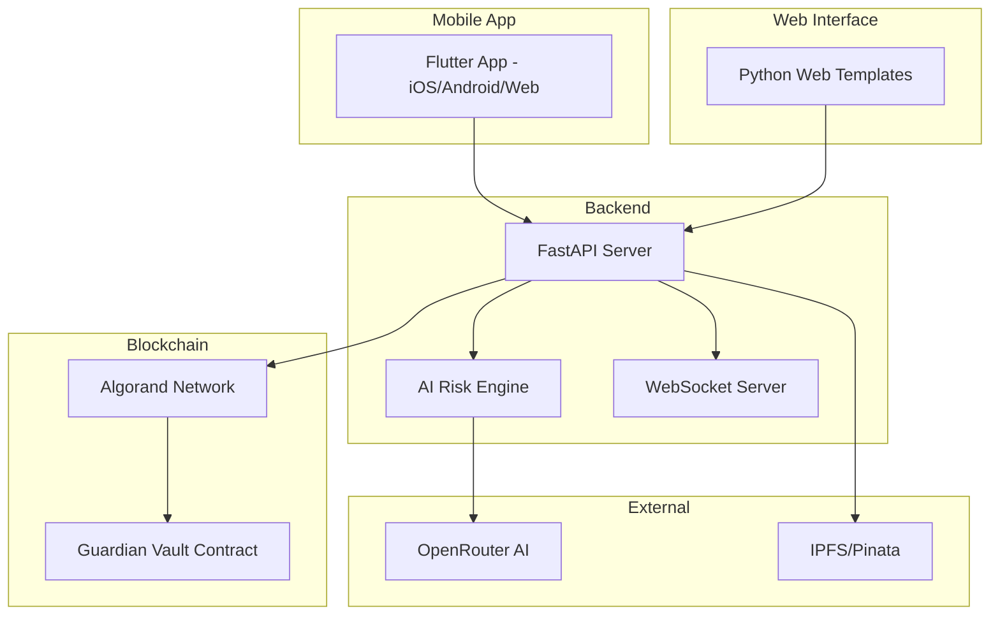

# NeuralTrust - AI-Powered DeFi Risk & Compliance Platform

<div align="center">


**AI-Powered Risk Analysis • Smart Contract Auditing • Real-Time Protection**

[](https://algorand.com)
[](https://python.org)
[](https://flutter.dev)
[](https://fastapi.tiangolo.com)
[](https://opensource.org/licenses/MIT)

</div>

---

## 🚀 Overview

NeuralTrust (ChainGuardian) is a comprehensive DeFi risk management platform that combines **off-chain AI intelligence** with **on-chain blockchain enforcement** to protect users from risky or fraudulent financial actions on the Algorand blockchain.

### Key Features

- 🤖 **AI Risk Analysis** - Advanced AI models analyze transactions for potential risks
- 📝 **Smart Contract Auditing** - Automated vulnerability detection for TEAL and Python contracts
- 🛡️ **Guardian Vault** - On-chain risk threshold enforcement
- 📊 **Portfolio Analysis** - Comprehensive risk assessment of your holdings
- 🔔 **Real-Time Alerts** - WebSocket-based instant notifications
- 📱 **Mobile App** - Cross-platform Flutter app for iOS, Android, and Web
- 🌐 **Web Dashboard** - Python-based web interface with Jinja2 templates

---

## 📁 Project Structure

```
neural-trust/
├── projects/
│   ├── backend/           # FastAPI Python Backend
│   │   ├── app/
│   │   │   ├── api/       # API Routes
│   │   │   ├── models/    # Database Models
│   │   │   ├── services/  # Business Logic
│   │   │   ├── templates/ # Web Templates (Jinja2)
│   │   │   └── static/    # Static Assets
│   │   └── requirements.txt
│   │
│   └── contracts/         # Algorand Smart Contracts
│       └── smart_contracts/
│           ├── guardian_vault/  # Main Vault Contract
│           ├── bank/            # Bank Demo Contract
│           └── counter/         # Counter Demo Contract
│
├── NeuralTrust/           # Flutter Mobile App
│   ├── lib/
│   │   ├── screens/      # App Screens
│   │   │   ├── dashboard/   # Main Dashboard
│   │   │   ├── risk/        # Risk Analysis
│   │   │   ├── alerts/      # Notifications
│   │   │   ├── profile/     # User Profile
│   │   │   └── settings/    # App Settings
│   │   ├── widgets/      # Reusable Widgets
│   │   └── theme/        # App Theme
│   └── pubspec.yaml
│
└── plans/                 # Project Documentation
    └── chainguardian-plan.md
```

---

## 🏗️ Architecture



---

## 🛠️ Tech Stack

| Component | Technology |
|-----------|------------|
| **Backend** | Python 3.11+, FastAPI, SQLAlchemy, Pydantic |
| **AI Engine** | OpenRouter API, Custom Rule Engine |
| **Blockchain** | Algorand, PyTeal, AlgoKit |
| **Web Interface** | Jinja2 Templates, TailwindCSS |
| **Mobile App** | Flutter, Dart |
| **Database** | SQLite (dev), PostgreSQL (prod) |
| **Real-Time** | WebSocket |
| **Storage** | IPFS/Pinata |

---

## 🚀 Quick Start

### Prerequisites

- Python 3.11+
- Flutter SDK 3.0+
- AlgoKit CLI (optional, for smart contracts)

### 1. Clone the Repository

```bash
git clone https://github.com/your-repo/neural-trust.git
cd neural-trust
```

### 2. Start the Backend

```bash
cd projects/backend

# Create virtual environment
python -m venv venv
source venv/bin/activate  # On Windows: venv\Scripts\activate

# Install dependencies
pip install -r requirements.txt

# Set up environment
cp .env.template .env
# Edit .env with your API keys

# Run the server
python -m uvicorn app.main:app --host 0.0.0.0 --port 8000 --reload
```

### 3. Access the Web Dashboard

Open your browser and navigate to:
- Home: `http://localhost:8000/`
- Dashboard: `http://localhost:8000/dashboard`
- Vault: `http://localhost:8000/vault`
- Analysis: `http://localhost:8000/analysis`
- Audit: `http://localhost:8000/audit`

### 4. Start the Mobile App

```bash
cd NeuralTrust

# Get dependencies
flutter pub get

# Run on device
flutter run

# Or build for specific platform
flutter build apk        # Android
flutter build ios        # iOS
flutter build web        # Web
```

---

## 📱 Mobile App Features

The Flutter mobile app provides a complete mobile experience:

### Screens

| Screen | Description |
|--------|-------------|
| **Dashboard** | Overview of vault status, risk scores, and quick actions |
| **Risk Analysis** | Detailed risk breakdown and transaction analysis |
| **Alerts** | Real-time notifications and risk warnings |
| **Profile** | Wallet management and account settings |
| **Settings** | App preferences and notification controls |

### Platform Support

- ✅ Android (API 21+)
- ✅ iOS (iOS 12+)
- ✅ Web (Chrome, Safari, Firefox)
- ✅ macOS
- ✅ Windows
- ✅ Linux

---

## 🌐 Web Dashboard Features

The Python-based web interface provides:

| Page | Description |
|------|-------------|
| **Home** | Landing page with project overview |
| **Dashboard** | Vault status, risk scores, quick actions |
| **Vault** | Create and manage Guardian Vaults |
| **Analysis** | AI-powered transaction risk analysis |
| **Audit** | Smart contract auditing tools |

---

## 🔌 API Endpoints

### Core Endpoints

| Endpoint | Method | Description |
|----------|--------|-------------|
| `/health` | GET | Basic health check |
| `/health/detailed` | GET | Detailed service status |
| `/api/analysis/risk` | POST | Analyze transaction risk |
| `/api/audit/contract` | POST | Audit smart contract |
| `/api/reputation/{address}` | GET | Get address reputation |
| `/api/portfolio/analyze` | POST | Analyze portfolio risk |
| `/api/simulate/fees` | GET | Estimate transaction fees |
| `/ws/alerts` | WebSocket | Real-time alerts |

### Vault Management

| Endpoint | Method | Description |
|----------|--------|-------------|
| `/api/vault/create` | POST | Create new vault |
| `/api/vault/status` | GET/POST | Get vault status |
| `/api/vault/{address}` | GET/PUT | Get/Update vault |
| `/api/vault/freeze` | POST | Freeze vault |
| `/api/vault/unfreeze` | POST | Unfreeze vault |

### Full API Documentation

- Swagger UI: `http://localhost:8000/docs`
- ReDoc: `http://localhost:8000/redoc`

---

## ⚙️ Configuration

### Backend Environment Variables

Create `projects/backend/.env`:

```env
# Algorand Network
ALGORAND_NETWORK=testnet
ALGORAND_NODE_URL=https://testnet-api.algonode.cloud
ALGORAND_INDEXER_URL=https://testnet-idx.algonode.cloud

# AI Configuration
OPENROUTER_API_KEY=your_openrouter_api_key
AI_MODEL=anthropic/claude-3-haiku

# API Settings
API_HOST=0.0.0.0
API_PORT=8000
CORS_ORIGINS=["http://localhost:3000","http://localhost:5173"]

# Guardian Vault Contract
GUARDIAN_VAULT_APP_ID=0
```

---

## 🧪 Testing

### Backend Tests

```bash
cd projects/backend
python test_api.py
```

### Smart Contract Tests

```bash
cd projects/contracts
pytest tests/
```

### Mobile App Tests

```bash
cd NeuralTrust
flutter test
```

---

## 📊 Features Deep Dive

### AI Risk Analysis

The AI engine analyzes transactions using:
- Pattern matching for known attack vectors
- Historical transaction analysis
- Protocol-specific risk assessment
- Real-time threat intelligence

### Smart Contract Auditor

Detects vulnerabilities including:
- Reentrancy attacks
- Integer overflow/underflow
- Unprotected access control
- Front-running vulnerabilities
- Unbounded loops
- Missing error handling

### Guardian Vault

On-chain protection mechanism:
- User-defined risk thresholds
- Automatic transaction blocking
- Emergency freeze capability
- Immutable audit logging

---

## 🔐 Security

- All sensitive data encrypted at rest
- API keys stored securely in environment variables
- WebSocket connections authenticated
- Rate limiting on all endpoints
- Input validation with Pydantic

---

## 📈 Roadmap

- [ ] Multi-chain support (Ethereum, Polygon)
- [ ] Advanced AI models integration
- [ ] Social recovery for vaults
- [ ] DAO governance
- [ ] Mobile push notifications
- [ ] Hardware wallet support

---

## 🤝 Contributing

1. Fork the repository
2. Create a feature branch (`git checkout -b feature/amazing-feature`)
3. Commit your changes (`git commit -m 'Add amazing feature'`)
4. Push to the branch (`git push origin feature/amazing-feature`)
5. Open a Pull Request

---

## 📄 License

This project is licensed under the MIT License - see the [LICENSE](LICENSE) file for details.

---

## 🙏 Acknowledgments

- [Algorand Foundation](https://algorand.foundation) for blockchain infrastructure
- [AlgoKit](https://github.com/algorandfoundation/algokit-cli) for development tools
- [OpenRouter](https://openrouter.ai) for AI model access
- [Pinata](https://pinata.cloud) for IPFS storage

---

## 📞 Support

- Documentation: [docs.neuraltrust.io](https://docs.neuraltrust.io)
- Discord: [discord.gg/neuraltrust](https://discord.gg/neuraltrust)
- Twitter: [@NeuralTrust](https://twitter.com/NeuralTrust)
- Email: support@neuraltrust.io

---

<div align="center">

**Built with ❤️ by the NeuralTrust Team**

© 2026 NeuralTrust. All rights reserved.

</div>
