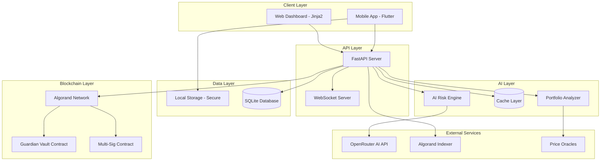
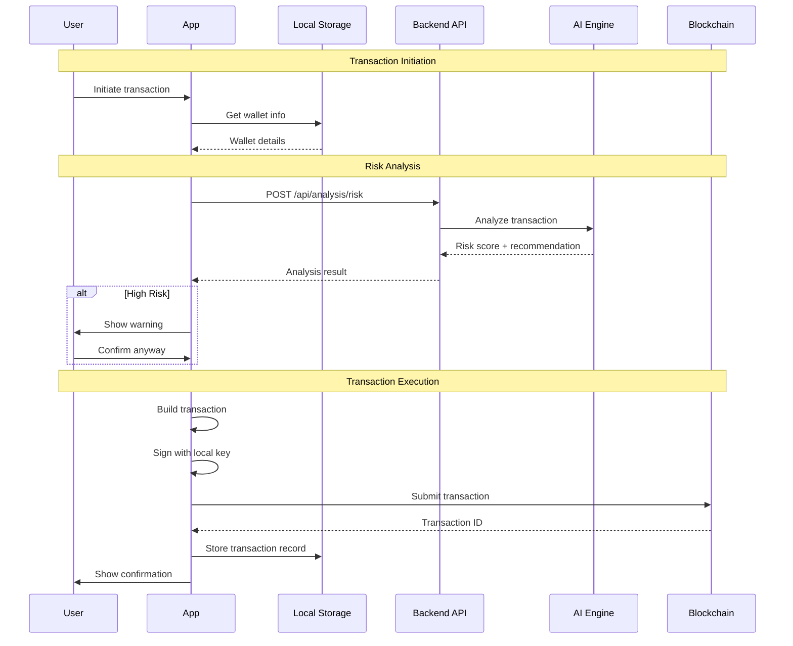
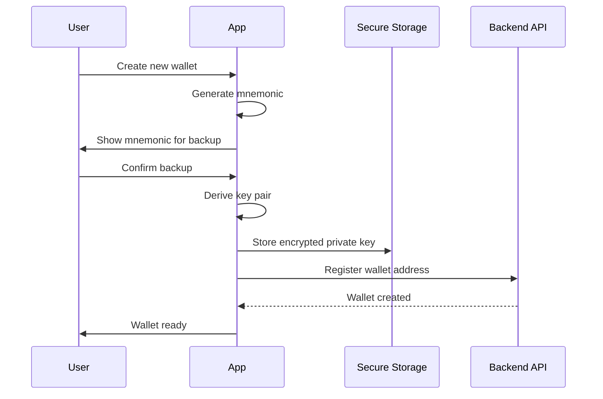
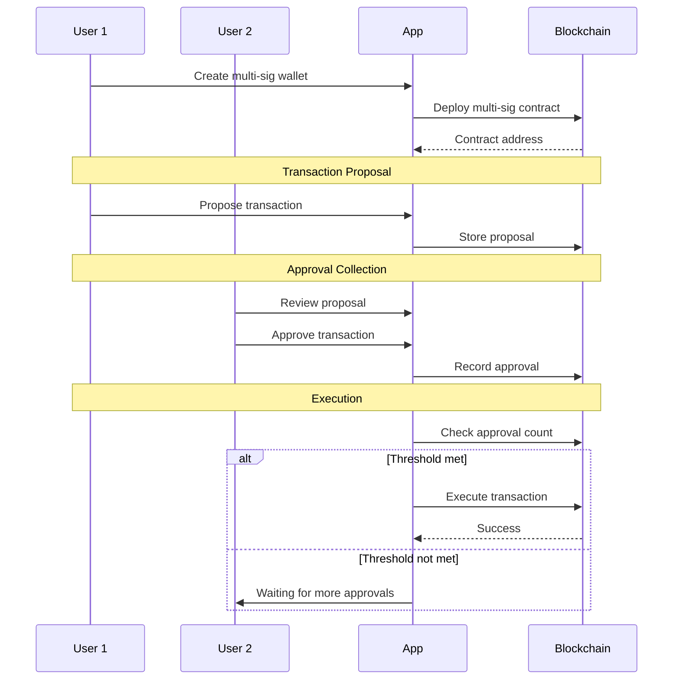
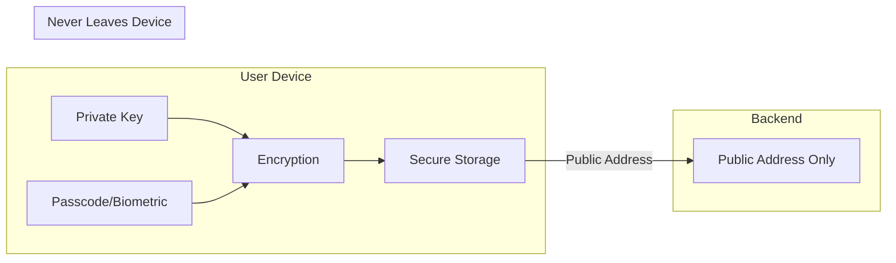
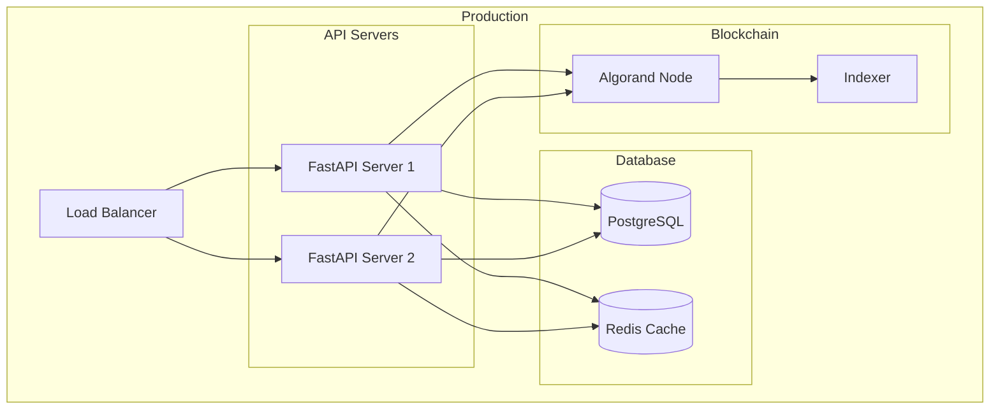

# NeuralTrust Architecture

This document provides a comprehensive overview of the NeuralTrust system architecture, design decisions, and component interactions.

## Table of Contents

1. [System Overview](#system-overview)
2. [High-Level Architecture](#high-level-architecture)
3. [Component Details](#component-details)
4. [Data Flow](#data-flow)
5. [Security Architecture](#security-architecture)
6. [Technology Stack](#technology-stack)

---

## System Overview

NeuralTrust is a three-tier application consisting of:

1. **Mobile/Web Frontend** - Flutter application for iOS, Android, and Web
2. **Backend API** - FastAPI Python server for AI analysis and data aggregation
3. **Blockchain Layer** - Algorand smart contracts for on-chain enforcement

### Design Principles

- **Security First**: All sensitive operations happen locally on user devices
- **AI-Enhanced**: Machine learning powers risk analysis and recommendations
- **Decentralized**: Core protection logic lives on-chain
- **User-Centric**: Simple UX abstracting complex blockchain operations

---

## High-Level Architecture



---

## Component Details

### 1. Mobile Application (Flutter)

**Location**: `NeuralTrust/`

The Flutter application provides cross-platform support for iOS, Android, and Web.

#### Key Modules

| Module | Purpose | Files |
|--------|---------|-------|
| **Core** | App configuration, routing | `main.dart`, `app.dart` |
| **Screens** | UI screens | `screens/` |
| **Widgets** | Reusable components | `widgets/` |
| **Services** | Business logic | `services/` |
| **Models** | Data models | `models/` |
| **Theme** | Styling | `theme/` |

#### New Services Architecture

```
lib/
├── services/
│   ├── algorand/
│   │   ├── algorand_service.dart      # Main Algorand integration
│   │   ├── wallet_service.dart        # Wallet management
│   │   ├── transaction_service.dart   # Transaction handling
│   │   └── multisig_service.dart      # Multi-signature support
│   ├── storage/
│   │   ├── local_storage_service.dart # Local data persistence
│   │   ├── secure_storage_service.dart # Encrypted storage
│   │   └── cache_service.dart         # Data caching
│   ├── api/
│   │   ├── backend_api_service.dart   # Backend API client
│   │   └── websocket_service.dart     # Real-time updates
│   └── portfolio/
│       ├── portfolio_service.dart     # Portfolio tracking
│       └── price_service.dart         # Price data fetching
├── models/
│   ├── wallet.dart
│   ├── transaction.dart
│   ├── portfolio.dart
│   └── risk_analysis.dart
└── providers/
    ├── wallet_provider.dart
    ├── portfolio_provider.dart
    └── settings_provider.dart
```

### 2. Backend API (FastAPI)

**Location**: `projects/backend/`

The FastAPI backend serves as the intelligence layer, providing AI-powered analysis and data aggregation.

#### API Routes

| Route | Purpose | File |
|-------|---------|------|
| `/api/analysis` | Transaction risk analysis | `api/routes/analysis.py` |
| `/api/audit` | Smart contract auditing | `api/routes/audit_contract.py` |
| `/api/reputation` | Address reputation scoring | `api/routes/reputation.py` |
| `/api/portfolio` | Portfolio analysis | `api/routes/portfolio.py` |
| `/api/simulate` | Transaction simulation | `api/routes/simulate.py` |
| `/api/vault` | Vault management | `api/routes/vault.py` |
| `/ws/alerts` | Real-time alerts | `api/websockets/alerts.py` |

#### Service Layer

| Service | Purpose |
|---------|---------|
| `AIRiskEngine` | AI-powered transaction analysis |
| `ContractAuditor` | Smart contract vulnerability detection |
| `ReputationService` | Address trust scoring |
| `PortfolioAnalyzer` | Portfolio risk assessment |
| `TransactionSimulator` | Pre-execution simulation |
| `BlockchainService` | Algorand node interaction |

### 3. Smart Contracts (PyTeal)

**Location**: `projects/contracts/`

Algorand smart contracts written in Python using PyTeal.

#### Guardian Vault Contract

The core protection contract that enforces user-defined security rules.

**Key Methods**:
- `create_vault()` - Initialize a new vault
- `set_threshold()` - Update risk threshold
- `add_guardian()` - Add a guardian address
- `freeze()` - Emergency freeze
- `unfreeze()` - Remove freeze
- `execute_transaction()` - Execute with validation

**State Schema**:
```
Global State:
- creator: bytes
- threshold: uint64
- frozen: uint64
- guardian_count: uint64

Local State:
- is_guardian: bytes
- approved: uint64
```

---

## Data Flow

### Transaction Flow



### Wallet Creation Flow



### Multi-Signature Flow



---

## Security Architecture

### Key Management



### Security Layers

| Layer | Protection | Implementation |
|-------|------------|----------------|
| **Device** | Secure enclave storage | flutter_secure_storage |
| **Application** | Biometric authentication | local_auth |
| **Network** | TLS encryption | HTTPS/WSS |
| **API** | Rate limiting, validation | FastAPI middleware |
| **Blockchain** | Smart contract rules | Guardian Vault |

### Data Classification

| Data Type | Storage | Encryption |
|-----------|---------|------------|
| Private Keys | Device only | AES-256 |
| Mnemonics | Device only | AES-256 |
| Transaction History | Device + Backend | TLS in transit |
| Risk Analysis | Backend | N/A |
| User Preferences | Device | N/A |

---

## Technology Stack

### Frontend (Flutter)

| Category | Technology | Version |
|----------|------------|---------|
| Framework | Flutter | 3.10+ |
| Language | Dart | 3.0+ |
| State Management | Riverpod | 2.6+ |
| Routing | go_router | 14.6+ |
| Charts | fl_chart | 0.68+ |
| Secure Storage | flutter_secure_storage | 9.2+ |
| Local Storage | shared_preferences | 2.2+ |
| Algorand SDK | algorand_dart | 1.0.3 |
| HTTP Client | dio | 5.4+ |
| WebSockets | web_socket_channel | 2.4+ |

### Backend (Python)

| Category | Technology | Version |
|----------|------------|---------|
| Framework | FastAPI | 0.109+ |
| Language | Python | 3.11+ |
| Database | SQLite/PostgreSQL | - |
| ORM | SQLAlchemy | 2.0+ |
| Validation | Pydantic | 2.5+ |
| HTTP Client | httpx | 0.26+ |
| AI Provider | OpenRouter | - |

### Blockchain (Algorand)

| Category | Technology | Version |
|----------|------------|---------|
| Network | Algorand | - |
| Smart Contracts | PyTeal | 0.29+ |
| SDK | py-algorand-sdk | 0.26+ |
| Development Tool | AlgoKit | 1.0+ |

---

## Deployment Architecture



---

## Scalability Considerations

### Horizontal Scaling

- Stateless API servers behind load balancer
- Database connection pooling
- Redis caching for frequently accessed data
- WebSocket connection distribution

### Performance Optimization

- Local caching of portfolio data
- Lazy loading of transaction history
- Background sync for price updates
- Optimistic UI updates with rollback

---

*Last Updated: February 2026*
