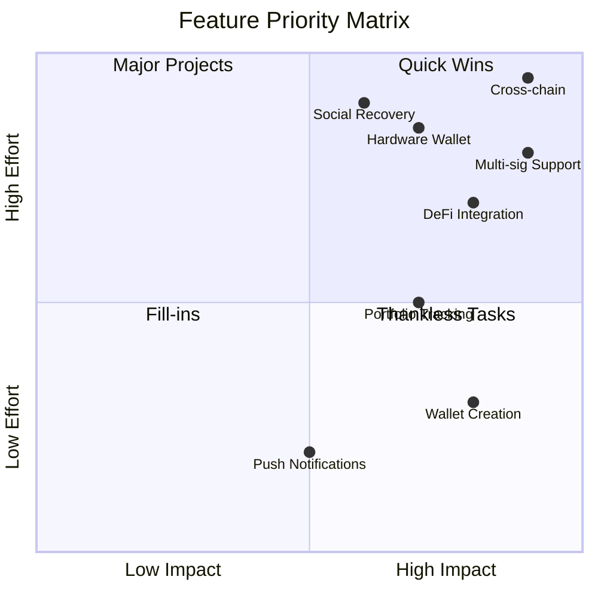

# Features Roadmap

This document outlines the current features, planned enhancements, and future roadmap for NeuralTrust.

## Table of Contents

1. [Current Features](#current-features)
2. [In Development](#in-development)
3. [Planned Features](#planned-features)
4. [Future Vision](#future-vision)
5. [Feature Requests](#feature-requests)

---

## Current Features

### ✅ Core Platform (v1.0)

| Feature | Status | Description |
|---------|--------|-------------|
| AI Risk Analysis | ✅ Complete | AI-powered transaction risk assessment |
| Smart Contract Auditor | ✅ Complete | TEAL/Python contract vulnerability detection |
| Address Reputation | ✅ Complete | Trust scoring for Algorand addresses |
| Portfolio Analysis | ✅ Complete | Risk assessment of asset holdings |
| Transaction Simulation | ✅ Complete | Pre-execution transaction testing |
| Guardian Vault | ✅ Complete | On-chain risk threshold enforcement |
| Web Dashboard | ✅ Complete | Python-based web interface |
| Mobile App | ✅ Complete | Flutter cross-platform application |
| Real-Time Alerts | ✅ Complete | WebSocket-based notifications |

### ✅ Backend API (v1.0)

| Endpoint | Status | Description |
|----------|--------|-------------|
| `/api/analysis/risk` | ✅ Complete | Single transaction analysis |
| `/api/analysis/batch` | ✅ Complete | Batch transaction analysis |
| `/api/audit/contract` | ✅ Complete | Contract vulnerability scanning |
| `/api/reputation/{address}` | ✅ Complete | Address reputation lookup |
| `/api/portfolio/analyze` | ✅ Complete | Portfolio risk analysis |
| `/api/simulate/transaction` | ✅ Complete | Transaction simulation |
| `/api/vault/*` | ✅ Complete | Vault management endpoints |
| `/ws/alerts` | ✅ Complete | Real-time alert WebSocket |

### ✅ Mobile App (v1.0)

| Screen | Status | Description |
|--------|--------|-------------|
| Dashboard | ✅ Complete | Overview and quick actions |
| Risk Analysis | ✅ Complete | Risk score visualization |
| Alerts | ✅ Complete | Notification center |
| Settings | ✅ Complete | App preferences |
| Profile | ✅ Complete | Account management |
| Onboarding | ✅ Complete | Get started flow |

---

## In Development

### 🔄 Algorand Integration (v1.1)

| Feature | Status | Priority |
|---------|--------|----------|
| algorand_dart SDK Integration | 🔄 In Progress | High |
| Wallet Creation | 🔄 In Progress | High |
| Wallet Import (Mnemonic) | 🔄 In Progress | High |
| Local Key Storage | 🔄 In Progress | High |
| Transaction Signing | 🔄 In Progress | High |
| ALGO Transfers | 🔄 In Progress | High |
| Asset (ASA) Support | 📋 Planned | Medium |

### 🔄 Local Storage (v1.1)

| Feature | Status | Priority |
|---------|--------|----------|
| Secure Storage Implementation | 🔄 In Progress | High |
| Hive Database Setup | 📋 Planned | High |
| Wallet Metadata Storage | 📋 Planned | High |
| Transaction History Cache | 📋 Planned | Medium |
| Settings Persistence | 📋 Planned | Medium |

### 🔄 Multi-Signature Support (v1.2)

| Feature | Status | Priority |
|---------|--------|----------|
| Multi-sig Address Creation | 📋 Planned | High |
| Transaction Proposals | 📋 Planned | High |
| Signature Collection | 📋 Planned | High |
| Threshold Execution | 📋 Planned | High |
| Guardian Management | 📋 Planned | Medium |

### 🔄 Portfolio Tracking (v1.2)

| Feature | Status | Priority |
|---------|--------|----------|
| Real-time Price Data | 📋 Planned | High |
| Portfolio Dashboard | 📋 Planned | High |
| Asset Allocation View | 📋 Planned | Medium |
| Performance Charts | 📋 Planned | Medium |
| Price Alerts | 📋 Planned | Medium |

---

## Planned Features

### 📋 Phase 1: Core Wallet Features (Q1 2026)

#### Wallet Management
- [ ] Create new wallet with mnemonic backup
- [ ] Import existing wallet via mnemonic
- [ ] Import wallet via private key
- [ ] Multiple wallet support
- [ ] Wallet naming and labels
- [ ] Wallet backup reminders

#### Transaction Features
- [ ] Send ALGO to address
- [ ] Send ALGO via QR code
- [ ] Request ALGO (QR code generation)
- [ ] Transaction history view
- [ ] Transaction details
- [ ] Transaction notes
- [ ] Fee customization

#### Security Features
- [ ] PIN protection
- [ ] Biometric authentication
- [ ] Auto-lock timer
- [ ] Transaction confirmation
- [ ] Risk warning display

### 📋 Phase 2: Advanced Features (Q2 2026)

#### Multi-Signature Wallets
- [ ] Create M-of-N multi-sig wallet
- [ ] Add/remove signers
- [ ] Propose transactions
- [ ] Approve/reject proposals
- [ ] Execute when threshold met
- [ ] Multi-sig transaction history

#### Asset Management
- [ ] View all ASA holdings
- [ ] Opt-in to assets
- [ ] Send/receive ASA
- [ ] Asset details view
- [ ] Asset price tracking
- [ ] Asset verification badges

#### Portfolio Analytics
- [ ] Total portfolio value
- [ ] 24h/7d/30d performance
- [ ] Asset allocation pie chart
- [ ] Historical value chart
- [ ] Top gainers/losers
- [ ] Risk exposure analysis

### 📋 Phase 3: DeFi Integration (Q3 2026)

#### Protocol Integration
- [ ] Tinyman DEX integration
- [ ] Yieldly integration
- [ ] Folks Finance integration
- [ ] Pact integration
- [ ] Vestige integration

#### DeFi Features
- [ ] Swap tokens
- [ ] Provide liquidity
- [ ] Stake assets
- [ ] View positions
- [ ] Claim rewards
- [ ] DeFi risk analysis

#### Advanced Trading
- [ ] Limit orders
- [ ] Price alerts
- [ ] Slippage settings
- [ ] Transaction routing
- [ ] MEV protection

### 📋 Phase 4: Social & Recovery (Q4 2026)

#### Social Recovery
- [ ] Designate recovery contacts
- [ ] Initiate recovery process
- [ ] Recovery approval flow
- [ ] Time-locked recovery
- [ ] Recovery history

#### Social Features
- [ ] Address book
- [ ] Contact labels
- [ ] Transaction memos
- [ ] Share transaction receipts
- [ ] Activity sharing (optional)

#### Notification Center
- [ ] Push notifications
- [ ] Email alerts
- [ ] Custom alert rules
- [ ] Quiet hours
- [ ] Alert categories

---

## Future Vision

### 🔮 Long-term Roadmap (2027+)

#### Cross-Chain Support
- Ethereum integration
- Polygon support
- Bitcoin support
- Cross-chain bridges
- Unified portfolio view

#### Advanced AI Features
- Personalized risk profiles
- Behavioral analysis
- Predictive alerts
- Fraud detection
- Market sentiment analysis

#### Enterprise Features
- Team wallets
- Spending policies
- Approval workflows
- Audit trails
- Compliance reporting

#### DAO Governance
- Governance token
- Proposal voting
- Treasury management
- Community features

#### Hardware Wallet Support
- Ledger integration
- Trezor integration
- Bluetooth connectivity
- Secure display

---

## Feature Priority Matrix

---

## Release Schedule

| Version | Target Date | Key Features |
|---------|-------------|--------------|
| v1.1 | March 2026 | Algorand integration, Local storage |
| v1.2 | April 2026 | Multi-sig, Portfolio tracking |
| v1.3 | June 2026 | Asset management, Analytics |
| v2.0 | September 2026 | DeFi integration |
| v2.5 | December 2026 | Social features, Recovery |
| v3.0 | 2027 | Cross-chain support |

---

## Feature Requests

### How to Request Features

1. Check existing issues on GitHub
2. Create a new issue with the `feature-request` label
3. Include:
   - Problem statement
   - Proposed solution
   - Use cases
   - Priority suggestion

### Top Requested Features

| Feature | Votes | Status |
|---------|-------|--------|
| Hardware wallet support | 45 | Planned (v2.5) |
| Ethereum support | 38 | Future |
| Push notifications | 32 | Planned (v1.3) |
| Dark/light theme toggle | 28 | Planned (v1.1) |
| Transaction batching | 25 | Planned (v1.2) |
| Recurring payments | 22 | Planned (v1.3) |
| NFT support | 20 | Planned (v2.0) |

---

## Contributing

Want to help build these features?

1. Check the [GitHub Issues](https://github.com/Meet6338-X/neural-trust/issues)
2. Join our development Discord
3. Submit a Pull Request
4. Help with testing and documentation

---

*Last Updated: February 2026*
