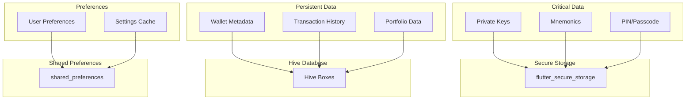

# Local Storage Strategy

This document outlines the local storage strategy for the NeuralTrust Flutter application, covering data persistence, security, and caching approaches.

## Table of Contents

1. [Overview](#overview)
2. [Storage Types](#storage-types)
3. [Secure Storage](#secure-storage)
4. [Hive Database](#hive-database)
5. [Shared Preferences](#shared-preferences)
6. [Data Models](#data-models)
7. [Migration Strategy](#migration-strategy)
8. [Best Practices](#best-practices)

---

## Overview

### Storage Requirements

| Data Type | Security Level | Storage Method |
|-----------|---------------|----------------|
| Private Keys | Critical | Secure Storage (Encrypted) |
| Mnemonics | Critical | Secure Storage (Encrypted) |
| PIN/Passcode | Critical | Secure Storage (Hashed) |
| Wallet Metadata | Medium | Hive Database |
| Transaction History | Medium | Hive Database |
| Portfolio Data | Low | Hive Database + Cache |
| User Preferences | Low | Shared Preferences |
| Cached API Responses | Low | Memory + Hive Cache |

### Storage Architecture



---

## Storage Types

### 1. Secure Storage (flutter_secure_storage)

For sensitive data that must never be exposed:
- Private keys
- Mnemonic phrases
- PIN codes (hashed)
- API keys

### 2. Hive Database

For structured data that needs queries:
- Wallet metadata
- Transaction history
- Portfolio snapshots
- Alert history

### 3. Shared Preferences

For simple key-value data:
- User preferences
- App settings
- Feature flags
- Session data

### 4. Memory Cache

For frequently accessed data:
- Current prices
- Portfolio balances
- API responses

---

## Secure Storage

### Implementation

```dart
// lib/services/storage/secure_storage_service.dart
import 'package:flutter_secure_storage/flutter_secure_storage.dart';

class SecureStorageService {
  static final SecureStorageService _instance = SecureStorageService._internal();
  factory SecureStorageService() => _instance;
  SecureStorageService._internal();
  
  late FlutterSecureStorage _storage;
  
  Future<void> initialize() async {
    _storage = const FlutterSecureStorage(
      aOptions: AndroidOptions(
        encryptedSharedPreferences: true,
      ),
      iOptions: IOSOptions(
        accessibility: KeychainAccessibility.first_unlock_this_device,
      ),
    );
  }
  
  // Store mnemonic securely
  Future<void> storeMnemonic({
    required String address,
    required String encryptedMnemonic,
  }) async {
    await _storage.write(
      key: 'mnemonic_$address',
      value: encryptedMnemonic,
    );
  }
  
  // Retrieve mnemonic
  Future<String?> getMnemonic(String address) async {
    return await _storage.read(key: 'mnemonic_$address');
  }
  
  // Delete mnemonic
  Future<void> deleteMnemonic(String address) async {
    await _storage.delete(key: 'mnemonic_$address');
  }
  
  // Store PIN hash
  Future<void> storePinHash(String pinHash) async {
    await _storage.write(key: 'pin_hash', value: pinHash);
  }
  
  // Get PIN hash
  Future<String?> getPinHash() async {
    return await _storage.read(key: 'pin_hash');
  }
  
  // Store API key
  Future<void> storeApiKey(String serviceName, String apiKey) async {
    await _storage.write(key: 'api_key_$serviceName', value: apiKey);
  }
  
  // Clear all secure storage
  Future<void> clearAll() async {
    await _storage.deleteAll();
  }
}
```

### Platform-Specific Security

| Platform | Security Mechanism |
|----------|-------------------|
| Android | EncryptedSharedPreferences (AES-256) |
| iOS | Keychain (Secure Enclave when available) |
| Web | Encrypted localStorage |
| macOS | Keychain |
| Windows | Windows Credential Manager |
| Linux | libsecret |

---

## Hive Database

### Setup

```dart
// lib/services/storage/hive_service.dart
import 'package:hive_flutter/hive_flutter.dart';

class HiveService {
  static final HiveService _instance = HiveService._internal();
  factory HiveService() => _instance;
  HiveService._internal();
  
  Future<void> initialize() async {
    await Hive.initFlutter();
    
    // Register adapters
    _registerAdapters();
    
    // Open boxes
    await _openBoxes();
  }
  
  void _registerAdapters() {
    Hive.registerAdapter(WalletAdapter());
    Hive.registerAdapter(TransactionAdapter());
    Hive.registerAdapter(AssetAdapter());
    Hive.registerAdapter(AlertAdapter());
    Hive.registerAdapter(PortfolioSnapshotAdapter());
  }
  
  Future<void> _openBoxes() async {
    await Hive.openBox<Wallet>('wallets');
    await Hive.openBox<Transaction>('transactions');
    await Hive.openBox<Asset>('assets');
    await Hive.openBox<Alert>('alerts');
    await Hive.openBox<PortfolioSnapshot>('portfolio');
    await Hive.openBox('settings');
    await Hive.openBox('cache');
  }
}
```

### Data Models with Hive Adapters

```dart
// lib/models/wallet.dart
import 'package:hive/hive.dart';

part 'wallet.g.dart';

@HiveType(typeId: 0)
class Wallet extends HiveObject {
  @HiveField(0)
  String id;
  
  @HiveField(1)
  String name;
  
  @HiveField(2)
  String address;
  
  @HiveField(3)
  DateTime createdAt;
  
  @HiveField(4)
  bool isImported;
  
  @HiveField(5)
  bool isMultisig;
  
  @HiveField(6)
  int? threshold;
  
  @HiveField(7)
  List<String>? signers;
  
  @HiveField(8)
  String? lastBalance;
  
  @HiveField(9)
  DateTime? lastSync;
  
  Wallet({
    required this.id,
    required this.name,
    required this.address,
    required this.createdAt,
    this.isImported = false,
    this.isMultisig = false,
    this.threshold,
    this.signers,
    this.lastBalance,
    this.lastSync,
  });
}
```

```dart
// lib/models/transaction.dart
part 'transaction.g.dart';

@HiveType(typeId: 1)
class Transaction extends HiveObject {
  @HiveField(0)
  String txId;
  
  @HiveField(1)
  String walletId;
  
  @HiveField(2)
  String type; // 'send', 'receive', 'swap', etc.
  
  @HiveField(3)
  String sender;
  
  @HiveField(4)
  String? recipient;
  
  @HiveField(5)
  int amount;
  
  @HiveField(6)
  int fee;
  
  @HiveField(7)
  int? assetId;
  
  @HiveField(8)
  DateTime timestamp;
  
  @HiveField(9)
  int? confirmedRound;
  
  @HiveField(10)
  String status; // 'pending', 'confirmed', 'failed'
  
  @HiveField(11)
  String? note;
  
  @HiveField(12)
  int? riskScore;
  
  Transaction({
    required this.txId,
    required this.walletId,
    required this.type,
    required this.sender,
    this.recipient,
    required this.amount,
    required this.fee,
    this.assetId,
    required this.timestamp,
    this.confirmedRound,
    required this.status,
    this.note,
    this.riskScore,
  });
}
```

### Repository Pattern

```dart
// lib/repositories/wallet_repository.dart
class WalletRepository {
  final HiveService _hiveService;
  
  Box<Wallet> get _box => Hive.box<Wallet>('wallets');
  
  // Create
  Future<void> saveWallet(Wallet wallet) async {
    await _box.put(wallet.id, wallet);
  }
  
  // Read
  Wallet? getWallet(String id) {
    return _box.get(id);
  }
  
  List<Wallet> getAllWallets() {
    return _box.values.toList();
  }
  
  // Update
  Future<void> updateWallet(Wallet wallet) async {
    await wallet.save();
  }
  
  Future<void> updateWalletBalance(String id, String balance) async {
    final wallet = _box.get(id);
    if (wallet != null) {
      wallet.lastBalance = balance;
      wallet.lastSync = DateTime.now();
      await wallet.save();
    }
  }
  
  // Delete
  Future<void> deleteWallet(String id) async {
    await _box.delete(id);
  }
  
  // Query
  List<Wallet> getMultisigWallets() {
    return _box.values.where((w) => w.isMultisig).toList();
  }
  
  Wallet? getWalletByAddress(String address) {
    return _box.values.firstWhere(
      (w) => w.address == address,
      orElse: () => null,
    );
  }
}
```

### Transaction Repository

```dart
// lib/repositories/transaction_repository.dart
class TransactionRepository {
  Box<Transaction> get _box => Hive.box<Transaction>('transactions');
  
  Future<void> saveTransaction(Transaction tx) async {
    await _box.put(tx.txId, tx);
  }
  
  List<Transaction> getWalletTransactions(String walletId) {
    return _box.values
        .where((tx) => tx.walletId == walletId)
        .toList()
      ..sort((a, b) => b.timestamp.compareTo(a.timestamp));
  }
  
  List<Transaction> getPendingTransactions() {
    return _box.values
        .where((tx) => tx.status == 'pending')
        .toList();
  }
  
  Future<void> updateTransactionStatus(String txId, String status, {int? confirmedRound}) async {
    final tx = _box.get(txId);
    if (tx != null) {
      tx.status = status;
      tx.confirmedRound = confirmedRound;
      await tx.save();
    }
  }
  
  List<Transaction> getTransactionsByDateRange(
    String walletId, {
    required DateTime start,
    required DateTime end,
  }) {
    return _box.values
        .where((tx) => 
            tx.walletId == walletId &&
            tx.timestamp.isAfter(start) &&
            tx.timestamp.isBefore(end))
        .toList();
  }
  
  Future<void> clearWalletTransactions(String walletId) async {
    final keys = _box.keys
        .where((key) => _box.get(key)?.walletId == walletId)
        .toList();
    
    for (final key in keys) {
      await _box.delete(key);
    }
  }
}
```

---

## Shared Preferences

### Implementation

```dart
// lib/services/storage/preferences_service.dart
import 'package:shared_preferences/shared_preferences.dart';

class PreferencesService {
  static final PreferencesService _instance = PreferencesService._internal();
  factory PreferencesService() => _instance;
  PreferencesService._internal();
  
  late SharedPreferences _prefs;
  
  Future<void> initialize() async {
    _prefs = await SharedPreferences.getInstance();
  }
  
  // Theme
  Future<void> setThemeMode(String mode) async {
    await _prefs.setString('theme_mode', mode);
  }
  
  String getThemeMode() {
    return _prefs.getString('theme_mode') ?? 'dark';
  }
  
  // Notifications
  Future<void> setNotificationsEnabled(bool enabled) async {
    await _prefs.setBool('notifications_enabled', enabled);
  }
  
  bool getNotificationsEnabled() {
    return _prefs.getBool('notifications_enabled') ?? true;
  }
  
  // Risk threshold
  Future<void> setRiskThreshold(int threshold) async {
    await _prefs.setInt('risk_threshold', threshold);
  }
  
  int getRiskThreshold() {
    return _prefs.getInt('risk_threshold') ?? 50;
  }
  
  // Currency
  Future<void> setCurrency(String currency) async {
    await _prefs.setString('currency', currency);
  }
  
  String getCurrency() {
    return _prefs.getString('currency') ?? 'USD';
  }
  
  // Language
  Future<void> setLanguage(String language) async {
    await _prefs.setString('language', language);
  }
  
  String getLanguage() {
    return _prefs.getString('language') ?? 'en';
  }
  
  // Biometric
  Future<void> setBiometricEnabled(bool enabled) async {
    await _prefs.setBool('biometric_enabled', enabled);
  }
  
  bool getBiometricEnabled() {
    return _prefs.getBool('biometric_enabled') ?? false;
  }
  
  // Last sync
  Future<void> setLastSync(DateTime dateTime) async {
    await _prefs.setString('last_sync', dateTime.toIso8601String());
  }
  
  DateTime? getLastSync() {
    final value = _prefs.getString('last_sync');
    return value != null ? DateTime.parse(value) : null;
  }
  
  // Onboarding complete
  Future<void> setOnboardingComplete(bool complete) async {
    await _prefs.setBool('onboarding_complete', complete);
  }
  
  bool getOnboardingComplete() {
    return _prefs.getBool('onboarding_complete') ?? false;
  }
  
  // Clear all preferences
  Future<void> clearAll() async {
    await _prefs.clear();
  }
}
```

---

## Data Models

### Complete Model Structure

```
lib/models/
├── wallet.dart              # Wallet model
├── wallet.g.dart            # Generated adapter
├── transaction.dart         # Transaction model
├── transaction.g.dart       # Generated adapter
├── asset.dart               # Asset model
├── asset.g.dart             # Generated adapter
├── alert.dart               # Alert model
├── alert.g.dart             # Generated adapter
├── portfolio_snapshot.dart  # Portfolio snapshot
├── portfolio_snapshot.g.dart
├── multisig_proposal.dart   # Multi-sig proposal
└── multisig_proposal.g.dart
```

### Asset Model

```dart
@HiveType(typeId: 2)
class Asset extends HiveObject {
  @HiveField(0)
  int assetId;
  
  @HiveField(1)
  String name;
  
  @HiveField(2)
  String unitName;
  
  @HiveField(3)
  int decimals;
  
  @HiveField(4)
  String? logoUrl;
  
  @HiveField(5)
  double? priceUsd;
  
  @HiveField(6)
  DateTime? priceUpdatedAt;
  
  Asset({
    required this.assetId,
    required this.name,
    required this.unitName,
    required this.decimals,
    this.logoUrl,
    this.priceUsd,
    this.priceUpdatedAt,
  });
}
```

### Alert Model

```dart
@HiveType(typeId: 3)
class Alert extends HiveObject {
  @HiveField(0)
  String id;
  
  @HiveField(1)
  String title;
  
  @HiveField(2)
  String message;
  
  @HiveField(3)
  String severity; // 'low', 'medium', 'high', 'critical'
  
  @HiveField(4)
  DateTime createdAt;
  
  @HiveField(5)
  bool isRead;
  
  @HiveField(6)
  String? transactionId;
  
  @HiveField(7)
  String? walletId;
  
  @HiveField(8)
  Map<String, dynamic>? data;
  
  Alert({
    required this.id,
    required this.title,
    required this.message,
    required this.severity,
    required this.createdAt,
    this.isRead = false,
    this.transactionId,
    this.walletId,
    this.data,
  });
}
```

---

## Migration Strategy

### Version Management

```dart
// lib/services/storage/migration_service.dart
class MigrationService {
  static const int currentVersion = 1;
  
  Future<void> migrate() async {
    final prefs = await SharedPreferences.getInstance();
    final dbVersion = prefs.getInt('db_version') ?? 0;
    
    if (dbVersion < 1) {
      await _migrateToV1();
    }
    
    await prefs.setInt('db_version', currentVersion);
  }
  
  Future<void> _migrateToV1() async {
    // Initial migration - create default data
    // This runs on first install or when upgrading from v0
  }
}
```

### Backup and Restore

```dart
// lib/services/storage/backup_service.dart
class BackupService {
  final SecureStorageService _secureStorage;
  final HiveService _hiveService;
  
  Future<Map<String, dynamic>> createBackup(String pin) async {
    final backup = <String, dynamic>{};
    
    // Export wallets (without private keys)
    final wallets = Hive.box<Wallet>('wallets').values.toList();
    backup['wallets'] = wallets.map((w) => {
      'id': w.id,
      'name': w.name,
      'address': w.address,
      'is_multisig': w.isMultisig,
      'threshold': w.threshold,
      'signers': w.signers,
    }).toList();
    
    // Export settings
    backup['settings'] = {
      'theme': await _preferencesService.getThemeMode(),
      'currency': await _preferencesService.getCurrency(),
      'language': await _preferencesService.getLanguage(),
      'risk_threshold': await _preferencesService.getRiskThreshold(),
    };
    
    // Encrypt backup
    final encrypted = _encryptBackup(backup, pin);
    
    return {
      'version': 1,
      'timestamp': DateTime.now().toIso8601String(),
      'data': encrypted,
    };
  }
  
  Future<void> restoreBackup(Map<String, dynamic> backup, String pin) async {
    final decrypted = _decryptBackup(backup['data'], pin);
    
    // Restore wallets
    for (final walletData in decrypted['wallets']) {
      // Wallet will need to be re-imported with mnemonic
      // This just restores metadata
    }
    
    // Restore settings
    final settings = decrypted['settings'];
    await _preferencesService.setThemeMode(settings['theme']);
    await _preferencesService.setCurrency(settings['currency']);
    await _preferencesService.setLanguage(settings['language']);
    await _preferencesService.setRiskThreshold(settings['risk_threshold']);
  }
}
```

---

## Best Practices

### 1. Never Store Sensitive Data in Plain Text

```dart
// ❌ Bad
await prefs.setString('mnemonic', mnemonic);

// ✅ Good
await secureStorage.write(key: 'mnemonic_$address', value: encryptedMnemonic);
```

### 2. Use Transactions for Batch Operations

```dart
Future<void> batchInsertTransactions(List<Transaction> transactions) async {
  final box = Hive.box<Transaction>('transactions');
  
  // Use batch for better performance
  for (final tx in transactions) {
    await box.put(tx.txId, tx);
  }
}
```

### 3. Implement Data Expiration

```dart
class CachedData<T> {
  final T data;
  final DateTime cachedAt;
  final Duration ttl;
  
  bool get isExpired => DateTime.now().difference(cachedAt) > ttl;
  
  CachedData(this.data, this.ttl) : cachedAt = DateTime.now();
}
```

### 4. Handle Storage Errors Gracefully

```dart
Future<T?> safeRead<T>(String key, Future<T?> Function() read) async {
  try {
    return await read();
  } catch (e) {
    logger.error('Failed to read $key: $e');
    return null;
  }
}
```

### 5. Clear Sensitive Data on Logout

```dart
Future<void> logout() async {
  // Clear secure storage
  await secureStorage.clearAll();
  
  // Clear Hive boxes
  await Hive.box<Wallet>('wallets').clear();
  await Hive.box<Transaction>('transactions').clear();
  
  // Keep preferences (optional)
  // await preferences.clearAll();
}
```

---

## Storage Size Limits

| Storage Type | Limit | Notes |
|-------------|-------|-------|
| Secure Storage | Platform dependent | Keychain/KeyStore limits |
| Hive | No hard limit | Limited by device storage |
| Shared Preferences | ~1MB recommended | For small data only |
| Memory Cache | Available RAM | Cleared on app close |

---

*Last Updated: February 2026*
