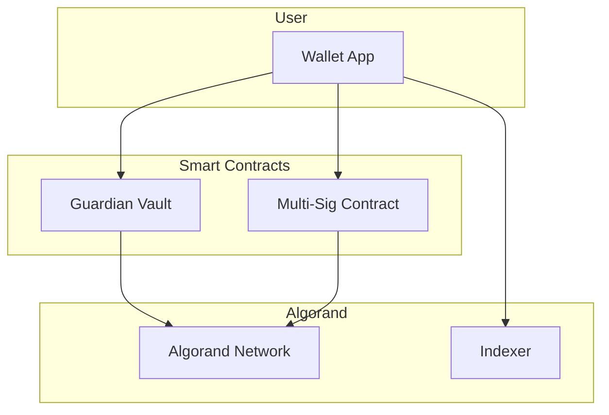

# Smart Contracts Documentation

This document provides comprehensive documentation for the NeuralTrust smart contracts deployed on the Algorand blockchain.

## Table of Contents

1. [Overview](#overview)
2. [Guardian Vault Contract](#guardian-vault-contract)
3. [Multi-Signature Contract](#multi-signature-contract)
4. [Deployment Guide](#deployment-guide)
5. [Testing](#testing)
6. [Security Considerations](#security-considerations)

---

## Overview

NeuralTrust uses Algorand smart contracts (written in Python using PyTeal) to provide on-chain protection mechanisms. The contracts are deployed using AlgoKit for development and testing.

### Contract Architecture



### Contract List

| Contract | Purpose | Location |
|----------|---------|----------|
| Guardian Vault | Risk threshold enforcement | `projects/contracts/smart_contracts/guardian_vault/` |
| Bank | Demo banking contract | `projects/contracts/smart_contracts/bank/` |
| Counter | Demo counter contract | `projects/contracts/smart_contracts/counter/` |

---

## Guardian Vault Contract

The Guardian Vault is the core protection contract that enforces user-defined security rules on-chain.

### Contract Location

```
projects/contracts/smart_contracts/guardian_vault/
├── contract.py        # Main contract logic
├── deploy_config.py   # Deployment configuration
└── README.md          # Contract documentation
```

### Features

- **Risk Threshold Enforcement**: Block transactions exceeding risk score
- **Spending Limits**: Daily/weekly transaction limits
- **Address Whitelisting**: Only allow transactions to trusted addresses
- **Emergency Freeze**: Instant freeze capability
- **Guardian System**: Trusted addresses for recovery
- **Audit Logging**: Immutable transaction history

### State Schema

#### Global State

| Key | Type | Description |
|-----|------|-------------|
| `creator` | bytes | Contract creator address |
| `threshold` | uint64 | Risk score threshold (0-100) |
| `frozen` | uint64 | Freeze status (0=active, 1=frozen) |
| `guardian_count` | uint64 | Number of guardians |
| `daily_limit` | uint64 | Daily spending limit in microAlgos |
| `daily_spent` | uint64 | Amount spent today |
| `last_reset` | uint64 | Last daily reset round |

#### Local State (Guardians)

| Key | Type | Description |
|-----|------|-------------|
| `is_guardian` | bytes | Guardian status |
| `approved` | uint64 | Approval status for pending actions |

### Contract Methods

#### create_vault()

Initialize a new vault with configuration.

```python
# Application call to create vault
app_call = ApplicationCallTxn(
    sender=owner_address,
    index=app_id,
    on_complete=OnComplete.OptIn,
    app_args=[b'create_vault', risk_threshold, daily_limit],
    accounts=guardian_addresses,
)
```

**Arguments:**
- `risk_threshold` (uint64): Risk score threshold (0-100)
- `daily_limit` (uint64): Daily spending limit in microAlgos
- `guardian_addresses` (list): List of guardian addresses

#### set_threshold()

Update the risk threshold.

```python
app_call = ApplicationCallTxn(
    sender=owner_address,
    index=app_id,
    on_complete=OnComplete.NoOp,
    app_args=[b'set_threshold', new_threshold],
)
```

**Requirements:**
- Only callable by vault owner
- Threshold must be 0-100

#### add_guardian()

Add a new guardian address.

```python
app_call = ApplicationCallTxn(
    sender=owner_address,
    index=app_id,
    on_complete=OnComplete.NoOp,
    app_args=[b'add_guardian'],
    accounts=[new_guardian_address],
)
```

**Requirements:**
- Only callable by vault owner
- Maximum 5 guardians

#### remove_guardian()

Remove a guardian address.

```python
app_call = ApplicationCallTxn(
    sender=owner_address,
    index=app_id,
    on_complete=OnComplete.NoOp,
    app_args=[b'remove_guardian'],
    accounts=[guardian_address],
)
```

#### freeze()

Emergency freeze the vault.

```python
app_call = ApplicationCallTxn(
    sender=owner_or_guardian,
    index=app_id,
    on_complete=OnComplete.NoOp,
    app_args=[b'freeze'],
)
```

**Requirements:**
- Callable by owner or any guardian
- Sets frozen state to 1

#### unfreeze()

Remove freeze from vault.

```python
app_call = ApplicationCallTxn(
    sender=owner_address,
    index=app_id,
    on_complete=OnComplete.NoOp,
    app_args=[b'unfreeze'],
)
```

**Requirements:**
- Only callable by owner
- Or by majority guardian approval

#### execute_transaction()

Execute a protected transaction.

```python
# Group transaction: app call + payment
group = [
    ApplicationCallTxn(
        sender=owner_address,
        index=app_id,
        on_complete=OnComplete.NoOp,
        app_args=[b'execute_transaction', risk_score],
    ),
    PaymentTxn(
        sender=owner_address,
        receiver=recipient_address,
        amt=amount,
        ...
    ),
]
```

**Validation:**
- Vault must not be frozen
- Risk score must be below threshold
- Daily limit must not be exceeded
- Transaction must be in same group

### Contract Code Structure

```python
# contract.py
from pyteal import *

class GuardianVault:
    def __init__(self):
        # State keys
        self.creator_key = Bytes("creator")
        self.threshold_key = Bytes("threshold")
        self.frozen_key = Bytes("frozen")
        self.guardian_count_key = Bytes("guardian_count")
        self.daily_limit_key = Bytes("daily_limit")
        self.daily_spent_key = Bytes("daily_spent")
        self.last_reset_key = Bytes("last_reset")
    
    def approval_program(self):
        # Main approval program logic
        return Cond(
            [Txn.application_id() == Int(0), self.create()],
            [Txn.on_completion() == OnComplete.OptIn, self.opt_in()],
            [Txn.on_completion() == OnComplete.NoOp, self.no_op()],
            [Txn.on_completion() == OnComplete.CloseOut, self.close_out()],
        )
    
    def create(self):
        # Initialize contract state
        return Seq([
            App.globalPut(self.creator_key, Txn.sender()),
            App.globalPut(self.threshold_key, Btoi(Txn.application_args[1])),
            App.globalPut(self.frozen_key, Int(0)),
            App.globalPut(self.guardian_count_key, Int(0)),
            App.globalPut(self.daily_limit_key, Btoi(Txn.application_args[2])),
            App.globalPut(self.daily_spent_key, Int(0)),
            Approve(),
        ])
    
    def no_op(self):
        # Handle method calls
        method = Txn.application_args[0]
        return Cond(
            [method == Bytes("set_threshold"), self.set_threshold()],
            [method == Bytes("add_guardian"), self.add_guardian()],
            [method == Bytes("remove_guardian"), self.remove_guardian()],
            [method == Bytes("freeze"), self.freeze()],
            [method == Bytes("unfreeze"), self.unfreeze()],
            [method == Bytes("execute_transaction"), self.execute_transaction()],
        )
    
    def execute_transaction(self):
        # Validate and execute transaction
        return Seq([
            # Check not frozen
            Assert(App.globalGet(self.frozen_key) == Int(0)),
            
            # Check risk score below threshold
            Assert(Btoi(Txn.application_args[1]) < App.globalGet(self.threshold_key)),
            
            # Check daily limit
            Assert(
                App.globalGet(self.daily_spent_key) + Gtxn[1].amount() 
                <= App.globalGet(self.daily_limit_key)
            ),
            
            # Update daily spent
            App.globalPut(
                self.daily_spent_key,
                App.globalGet(self.daily_spent_key) + Gtxn[1].amount()
            ),
            
            Approve(),
        ])
    
    def clear_state(self):
        return Approve()
```

---

## Multi-Signature Contract

Support for multi-signature wallets requiring multiple approvals for transactions.

### Features

- Configurable threshold (M of N)
- Add/remove signers
- Propose transactions
- Approve/reject proposals
- Execute when threshold met

### State Schema

#### Global State

| Key | Type | Description |
|-----|------|-------------|
| `threshold` | uint64 | Required approvals |
| `signer_count` | uint64 | Number of signers |
| `nonce` | uint64 | Transaction nonce |

#### Local State (Signers)

| Key | Type | Description |
|-----|------|-------------|
| `is_signer` | bytes | Signer status |
| `approved_nonce` | uint64 | Last approved nonce |

### Contract Methods

#### create_multisig()

Create a new multi-signature wallet.

```python
app_call = ApplicationCallTxn(
    sender=creator,
    index=app_id,
    on_complete=OnComplete.NoOp,
    app_args=[b'create_multisig', threshold],
    accounts=signer_addresses,
)
```

#### propose_transaction()

Propose a new transaction for approval.

```python
app_call = ApplicationCallTxn(
    sender=signer_address,
    index=app_id,
    on_complete=OnComplete.NoOp,
    app_args=[
        b'propose_transaction',
        recipient_address,
        amount,
        asset_id,  # 0 for ALGO
    ],
)
```

#### approve_transaction()

Approve a proposed transaction.

```python
app_call = ApplicationCallTxn(
    sender=signer_address,
    index=app_id,
    on_complete=OnComplete.NoOp,
    app_args=[b'approve_transaction', nonce],
)
```

#### execute_multisig()

Execute transaction when threshold met.

```python
group = [
    ApplicationCallTxn(
        sender=any_signer,
        index=app_id,
        on_complete=OnComplete.NoOp,
        app_args=[b'execute_multisig', nonce],
    ),
    PaymentTxn(
        sender=multisig_address,
        receiver=recipient,
        amt=amount,
        ...
    ),
]
```

---

## Deployment Guide

### Prerequisites

- AlgoKit installed
- Python 3.11+
- Algorand testnet/mainnet account with ALGO

### Deploy Using AlgoKit

```bash
# Navigate to contracts directory
cd projects/contracts

# Install dependencies
poetry install

# Deploy to testnet
algokit deploy

# Or deploy programmatically
python -m smart_contracts
```

### Deploy Configuration

```python
# deploy_config.py
from algokit_utils import DeploymentConfig

config = DeploymentConfig(
    network="testnet",
    creator_mnemonic="your_mnemonic_here",  # Use environment variable
    app_name="guardian_vault",
    version="1.0.0",
)
```

### Manual Deployment

```python
from algosdk import transaction
from smart_contracts.guardian_vault.contract import GuardianVault

# Compile contract
approval_program = compile_teal(
    GuardianVault().approval_program(),
    mode=Mode.Application,
    version=8,
)
clear_program = compile_teal(
    GuardianVault().clear_state(),
    mode=Mode.Application,
    version=8,
)

# Create application
app_create_tx = transaction.ApplicationCreateTxn(
    sender=creator_address,
    sp=suggested_params,
    on_complete=transaction.OnComplete.NoOpOC,
    approval_program=approval_program,
    clear_program=clear_program,
    global_schema=global_schema,
    local_schema=local_schema,
)

# Sign and submit
signed_tx = app_create_tx.sign(creator_private_key)
tx_id = algod_client.send_transaction(signed_tx)
```

---

## Testing

### Test Structure

```
projects/contracts/tests/
├── conftest.py              # Pytest fixtures
├── guardian_vault_test.py   # Guardian Vault tests
├── counter_test.py          # Counter contract tests
└── counter_client_test.py   # Client tests
```

### Running Tests

```bash
# Run all tests
poetry run pytest

# Run specific test file
poetry run pytest tests/guardian_vault_test.py

# Run with verbose output
poetry run pytest -v

# Run with coverage
poetry run pytest --cov=smart_contracts
```

### Test Example

```python
# tests/guardian_vault_test.py
import pytest
from algosdk import account
from smart_contracts.guardian_vault.contract import GuardianVault

class TestGuardianVault:
    
    @pytest.fixture
    def vault(self):
        return GuardianVault()
    
    def test_create_vault(self, vault, algod_client, creator_account):
        """Test vault creation."""
        # Create vault
        app_id = create_app(
            algod_client,
            creator_account,
            vault.approval_program(),
            vault.clear_state_program(),
        )
        
        # Verify state
        state = get_global_state(algod_client, app_id)
        assert state['creator'] == creator_account.address
        assert state['threshold'] == 50
        assert state['frozen'] == 0
    
    def test_freeze_vault(self, vault, algod_client, vault_app_id, owner_account):
        """Test vault freeze functionality."""
        # Freeze vault
        result = call_method(
            algod_client,
            owner_account,
            vault_app_id,
            'freeze',
        )
        
        # Verify frozen
        state = get_global_state(algod_client, vault_app_id)
        assert state['frozen'] == 1
    
    def test_execute_transaction_below_threshold(
        self, vault, algod_client, vault_app_id, owner_account
    ):
        """Test transaction execution below risk threshold."""
        # Execute transaction with risk score 30 (below threshold 50)
        result = execute_protected_transaction(
            algod_client,
            owner_account,
            vault_app_id,
            recipient=account.generate_account()[1],
            amount=1000000,
            risk_score=30,
        )
        
        assert result['confirmed-round'] > 0
    
    def test_execute_transaction_above_threshold(
        self, vault, algod_client, vault_app_id, owner_account
 ):
        """Test transaction rejection above risk threshold."""
        # Try to execute with risk score 70 (above threshold 50)
        with pytest.raises(Exception) as exc_info:
            execute_protected_transaction(
                algod_client,
                owner_account,
                vault_app_id,
                recipient=account.generate_account()[1],
                amount=1000000,
                risk_score=70,
            )
        
        assert "assertion failed" in str(exc_info.value).lower()
```

---

## Security Considerations

### Smart Contract Security

1. **Access Control**
   - All administrative functions restricted to owner
   - Guardian functions have separate permissions
   - No unauthorized state changes possible

2. **Input Validation**
   - All inputs validated before processing
   - Range checks on numeric values
   - Address format validation

3. **Reentrancy Protection**
   - State changes before external calls
   - No callback mechanisms

4. **Integer Safety**
   - All arithmetic uses safe operations
   - Overflow/underflow checks

### Best Practices

1. **Audit Before Deployment**
   - Professional security audit
   - Formal verification where possible
   - Testnet testing

2. **Upgrade Path**
   - Plan for contract upgrades
   - Migration strategy
   - User communication

3. **Emergency Procedures**
   - Emergency freeze capability
   - Guardian recovery process
   - Incident response plan

### Known Limitations

1. **Daily Limit Reset**
   - Reset based on block round
   - Approximate 24-hour period

2. **Guardian Management**
   - Maximum 5 guardians
   - No multi-sig for guardian changes

3. **Transaction Size**
   - Limited by Algorand transaction size
   - Group transaction limits

---

## Contract Addresses

### Testnet

| Contract | App ID | Address |
|----------|--------|---------|
| Guardian Vault | TBD | TBD |

### Mainnet

| Contract | App ID | Address |
|----------|--------|---------|
| Guardian Vault | TBD | TBD |

---

*Last Updated: February 2026*
