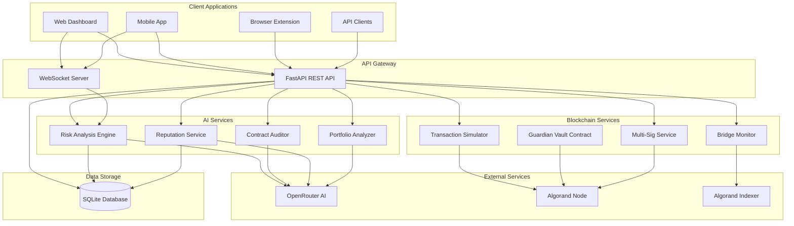

# ChainGuardian Backend Enhancement Plan - AI & Blockchain Focus

## Core Objective

**Build a production-ready AI-powered DeFi risk analysis platform on Algorand blockchain.**

Focus on solving real problems with AI and blockchain, not infrastructure complexity.

---

## Problem Statements We Solve

### 1. **Transaction Risk Assessment**
- Users need to know if a transaction is safe before executing
- AI analyzes patterns, addresses, amounts, and protocols
- Returns actionable recommendations (ALLOW, WARN, BLOCK)

### 2. **Smart Contract Security**
- Detect vulnerabilities in smart contracts before deployment
- AI-powered code analysis for Algorand smart contracts
- Security recommendations and best practices

### 3. **Address Reputation & Trust Scoring**
- Build reputation scores for Algorand addresses
- Track historical behavior and risk patterns
- Share trust signals across the network

### 4. **Portfolio Risk Monitoring**
- Real-time risk assessment of user portfolios
- Alert on high-risk assets or protocols
- AI-driven rebalancing suggestions

### 5. **Compliance & Audit Trail**
- Immutable on-chain audit logs
- Regulatory compliance reporting
- Transaction history with AI annotations

---

## Revised Enhancement Plan

### Phase 1: AI Engine Enhancements

#### 1.1 Multi-Model AI Support
**Files to modify:**
- `app/services/ai_engine.py`

**Features:**
- Support multiple AI models (OpenRouter, OpenAI, Anthropic)
- Model fallback chain for reliability
- Cost optimization with model selection
- Response caching for common queries

```python
class AIModelConfig:
    PRIMARY_MODEL = "neuralbase/nemotron-3-nano-30b-a3b:free"
    FALLBACK_MODELS = [
        "openai/gpt-4o-mini",
        "anthropic/claude-3-haiku"
    ]
```

#### 1.2 Smart Contract Auditor
**Files to create:**
- `app/services/contract_auditor.py`

**Features:**
- Analyze TEAL code for vulnerabilities
- PyTeal/Algorand Python code review
- Security recommendations
- Gas optimization suggestions

#### 1.3 Address Reputation Service
**Files to create:**
- `app/services/reputation_service.py`

**Features:**
- Calculate trust scores for addresses
- Historical behavior analysis
- Risk pattern detection
- Blacklist/whitelist management

#### 1.4 Portfolio Risk Analyzer
**Files to create:**
- `app/services/portfolio_analyzer.py`

**Features:**
- Asset risk scoring
- Protocol exposure analysis
- Concentration risk detection
- Rebalancing recommendations

---

### Phase 2: Blockchain Service Enhancements

#### 2.1 Transaction Simulator
**Files to create:**
- `app/services/transaction_simulator.py`

**Features:**
- Simulate transactions before execution
- Dry-run smart contract calls
- Estimate fees and resources
- Preview state changes

#### 2.2 Multi-Signature Support
**Files to create:**
- `app/services/multisig_service.py`

**Features:**
- Multi-sig transaction proposals
- Threshold signature collection
- Time-locked transactions
- Emergency freeze mechanisms

#### 2.3 Cross-Chain Bridge Monitor
**Files to create:**
- `app/services/bridge_monitor.py`

**Features:**
- Monitor bridge transactions
- Detect anomalous bridge activity
- Alert on potential exploits
- Track bridge liquidity

---

### Phase 3: API Enhancements

#### 3.1 New API Endpoints

| Endpoint | Method | Description |
|----------|--------|-------------|
| `/api/v1/audit/contract` | POST | Audit smart contract code |
| `/api/v1/reputation/{address}` | GET | Get address reputation score |
| `/api/v1/portfolio/analyze` | POST | Analyze portfolio risk |
| `/api/v1/simulate` | POST | Simulate transaction |
| `/api/v1/alerts` | GET | Get risk alerts |
| `/api/v1/alerts/subscribe` | POST | Subscribe to alerts |

#### 3.2 Enhanced Request/Response Models
**Files to modify:**
- `app/models/schemas.py`

**New Schemas:**
- `ContractAuditRequest` / `ContractAuditResponse`
- `ReputationScore` / `AddressHistory`
- `PortfolioAnalysisRequest` / `PortfolioRiskReport`
- `SimulationRequest` / `SimulationResult`
- `AlertSubscription` / `RiskAlert`

---

### Phase 4: Real-Time Features

#### 4.1 WebSocket Risk Alerts
**Files to create:**
- `app/api/websockets/alerts.py`

**Features:**
- Real-time risk score updates
- Transaction status notifications
- Portfolio alert streaming
- System health broadcasts

#### 4.2 Event-Driven Architecture
**Files to create:**
- `app/services/event_bus.py`

**Features:**
- Internal event publishing
- Async event handling
- Event persistence for replay
- Integration with blockchain events

---

### Phase 5: Quick Wins & Polish

#### 5.1 Update Copyright Year
**Files to modify:**
- `app/templates/base.html` - Change 2024 to 2026

#### 5.2 Enhanced Health Check
**Files to modify:**
- `app/main.py` - Add detailed health check

**Features:**
- AI service status
- Blockchain node connectivity
- Database status
- Version information

#### 5.3 API Documentation
**Files to modify:**
- `app/main.py` - Enhanced OpenAPI schema

**Features:**
- Detailed endpoint descriptions
- Request/response examples
- Error code documentation

---

## Architecture Diagram - AI & Blockchain Focus



---

## File Structure - Simplified

```
projects/backend/
├── app/
│   ├── __init__.py
│   ├── main.py                    # Enhanced with new routes
│   ├── config.py
│   ├── api/
│   │   ├── __init__.py
│   │   ├── routes/
│   │   │   ├── __init__.py
│   │   │   ├── analysis.py        # Enhanced
│   │   │   ├── audit.py           # Enhanced
│   │   │   ├── vault.py
│   │   │   ├── reputation.py      # NEW
│   │   │   ├── portfolio.py       # NEW
│   │   │   ├── simulate.py        # NEW
│   │   │   └── alerts.py          # NEW
│   │   └── websockets/
│   │       ├── __init__.py
│   │       └── alerts.py          # NEW
│   ├── models/
│   │   ├── __init__.py
│   │   ├── database.py
│   │   └── schemas.py             # Enhanced
│   └── services/
│       ├── __init__.py
│       ├── ai_engine.py           # Enhanced
│       ├── blockchain_service.py
│       ├── contract_auditor.py    # NEW
│       ├── reputation_service.py  # NEW
│       ├── portfolio_analyzer.py  # NEW
│       ├── transaction_simulator.py # NEW
│       ├── multisig_service.py    # NEW
│       ├── bridge_monitor.py      # NEW
│       └── event_bus.py           # NEW
├── pyproject.toml
└── requirements.txt
```

---

## Implementation Priority

| Priority | Feature | Impact | Effort |
|----------|---------|--------|--------|
| P0 | Update copyright to 2026 | Low | 5 min |
| P0 | Enhanced health check | Medium | Low |
| P1 | Contract Auditor | High | Medium |
| P1 | Address Reputation | High | Medium |
| P1 | Portfolio Analyzer | High | Medium |
| P2 | Transaction Simulator | High | Medium |
| P2 | WebSocket Alerts | Medium | Medium |
| P3 | Multi-Sig Support | Medium | High |
| P3 | Bridge Monitor | Medium | High |

---

## Key Features Deep Dive

### 1. Smart Contract Auditor

```python
# Example API usage
POST /api/v1/audit/contract
{
    "code": "#pragma version 8\n...",
    "language": "teal",
    "check_types": ["security", "optimization", "best_practices"]
}

# Response
{
    "risk_score": 35,
    "vulnerabilities": [
        {
            "type": "reentrancy",
            "severity": "high",
            "line": 42,
            "description": "Potential reentrancy vulnerability",
            "recommendation": "Add reentrancy guard"
        }
    ],
    "optimizations": [...],
    "best_practices": [...]
}
```

### 2. Address Reputation Service

```python
# Example API usage
GET /api/v1/reputation/ALGORAND_ADDRESS

# Response
{
    "address": "ALGORAND_ADDRESS",
    "trust_score": 85,
    "risk_level": "low",
    "first_seen": "2025-01-15",
    "total_transactions": 1234,
    "flags": [],
    "labels": ["verified", "active_trader"],
    "risk_factors": []
}
```

### 3. Portfolio Risk Analyzer

```python
# Example API usage
POST /api/v1/portfolio/analyze
{
    "address": "ALGORAND_ADDRESS",
    "include_recommendations": true
}

# Response
{
    "total_value_usd": 15000,
    "risk_score": 42,
    "risk_level": "medium",
    "asset_breakdown": [...],
    "protocol_exposure": [...],
    "concentration_risks": [...],
    "recommendations": [
        "Reduce exposure to high-risk protocol X",
        "Diversify across more asset types"
    ]
}
```

---

## Next Steps

1. **Immediate**: Update copyright year to 2026
2. **Priority 1**: Implement Contract Auditor service
3. **Priority 1**: Implement Address Reputation service
4. **Priority 1**: Implement Portfolio Analyzer service
5. **Priority 2**: Add Transaction Simulator
6. **Priority 2**: Add WebSocket alerts

---

## Questions Resolved

- ✅ Skip complex infrastructure (PostgreSQL, Redis, Celery)
- ✅ Keep SQLite for simplicity
- ✅ Focus on AI and blockchain capabilities
- ✅ Solve real DeFi security problems
- ✅ Maintain Jinja2 templates (they work fine)
