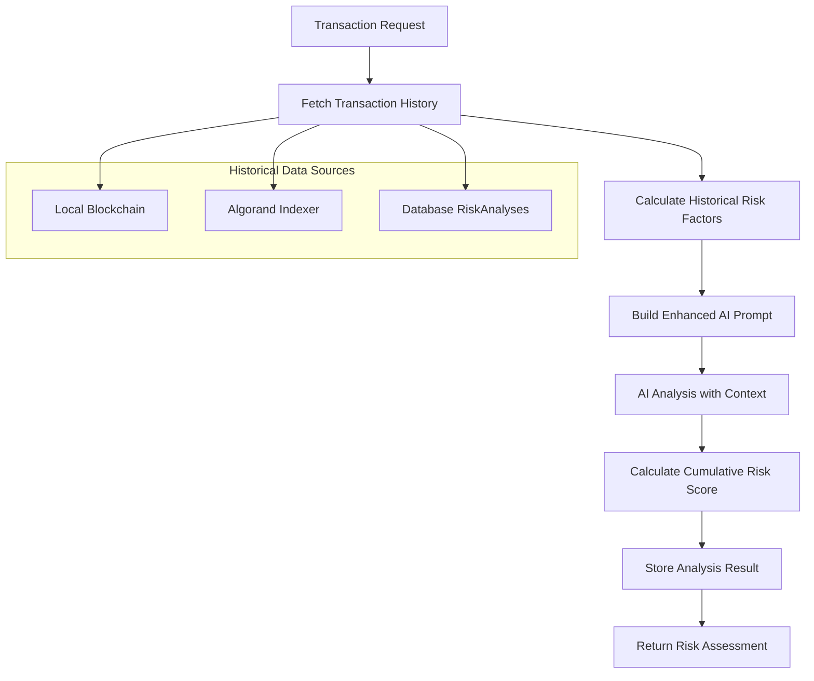

# Dynamic Risk Analysis with Transaction History

## Overview

This plan outlines the implementation of dynamic risk analysis that incorporates historical transaction data to provide cumulative risk profiles for addresses on the Algorand blockchain.

## Current State

The existing `AIRiskEngine` in [`ai_engine.py`](projects/backend/app/services/ai_engine.py) analyzes transactions in isolation without considering:
- Previous transaction history
- Cumulative risk patterns
- Address reputation over time
- Behavioral analysis

## Architecture



## Components to Implement

### 1. Transaction History Service

**File:** `projects/backend/app/services/transaction_history_service.py`

**Purpose:** Fetch and aggregate transaction history from multiple sources.

**Methods:**
- `get_address_transaction_history(address: str, limit: int)` - Get past transactions for an address
- `get_risk_analysis_history(address: str, limit: int)` - Get previous risk analyses
- `calculate_transaction_patterns(address: str)` - Analyze transaction patterns
- `get_address_statistics(address: str)` - Get aggregated stats for an address

### 2. Historical Risk Factor Calculator

**File:** `projects/backend/app/services/risk_calculator_service.py`

**Purpose:** Calculate risk factors based on historical data.

**Risk Factors to Calculate:**
| Factor | Description | Weight |
|--------|-------------|--------|
| Transaction Frequency | How often the address transacts | 15% |
| Average Transaction Amount | Typical transaction size | 10% |
| Previous Risk Scores | Historical risk assessments | 25% |
| Recipient Diversity | Number of unique recipients | 10% |
| Time-based Patterns | Unusual timing patterns | 15% |
| Failed/Blocked Transactions | History of blocked transactions | 25% |

### 3. Enhanced AI Engine

**Modifications to:** `projects/backend/app/services/ai_engine.py`

**New Methods:**
- `analyze_transaction_with_history(transaction_data, history_data)` - Main analysis with history
- `_build_historical_context(history_data)` - Build context from history
- `_calculate_cumulative_score(current_score, historical_factors)` - Combine scores
- `_calculate_reputation_score(address)` - Calculate address reputation

**Enhanced Prompt Structure:**
```
Transaction Details:
- Type: transfer
- Amount: 5.0 ALGO
- Sender: ADDRESS1
- Recipient: ADDRESS2

Historical Context:
- Previous Transactions: 15
- Average Amount: 3.2 ALGO
- Previous Risk Scores: [25, 30, 45, 20]
- Blocked Transactions: 1
- Account Age: 45 days
- Recipient Diversity: 8 unique addresses

Risk Factor Summary:
- Transaction Frequency Score: 20/100
- Amount Pattern Score: 15/100
- Historical Risk Score: 28/100
- Reputation Score: 22/100

Based on this context, analyze the current transaction...
```

### 4. Cumulative Risk Profile Model

**Add to:** `projects/backend/app/models/database.py`

**New Model:** `AddressRiskProfile`
```python
class AddressRiskProfile(Base):
    __tablename__ = "address_risk_profiles"
    
    id = Column(Integer, primary_key=True)
    address = Column(String(58), unique=True, index=True)
    total_transactions = Column(Integer, default=0)
    total_volume = Column(Float, default=0.0)
    average_risk_score = Column(Float, default=0.0)
    cumulative_risk_score = Column(Integer, default=0)
    risk_trend = Column(String(20))  # improving, stable, declining
    last_analysis = Column(DateTime)
    created_at = Column(DateTime, default=datetime.utcnow)
    updated_at = Column(DateTime, onupdate=datetime.utcnow)
```

### 5. New API Endpoints

**Add to:** `projects/backend/app/api/routes/analysis.py`

| Endpoint | Method | Description |
|----------|--------|-------------|
| `/api/analysis/profile/{address}` | GET | Get cumulative risk profile |
| `/api/analysis/history/{address}` | GET | Get analysis history |
| `/api/analysis/factors/{address}` | GET | Get risk factor breakdown |

## Implementation Steps

### Step 1: Create Transaction History Service
- Create service file
- Implement Algorand indexer integration
- Add local blockchain history fetching
- Add database query for past analyses

### Step 2: Create Risk Calculator Service
- Implement risk factor calculations
- Add weighted scoring algorithm
- Create reputation calculation logic

### Step 3: Enhance AI Engine
- Add history parameter to analysis methods
- Update prompt builder with historical context
- Implement cumulative score calculation
- Add reputation scoring

### Step 4: Add Database Model
- Create AddressRiskProfile model
- Add migration for new table
- Update related models

### Step 5: Add API Endpoints
- Implement profile endpoint
- Implement history endpoint
- Implement factors endpoint
- Update existing risk endpoint to use history

### Step 6: Testing
- Test with your Algorand addresses
- Verify historical data fetching
- Validate risk calculations
- Test cumulative scoring

## Risk Scoring Algorithm

```python
def calculate_cumulative_risk(
    current_score: int,
    historical_factors: dict,
    reputation_score: int
) -> int:
    """
    Calculate cumulative risk score.
    
    Formula:
    cumulative = (
        current_score * 0.40 +           # Current transaction risk
        historical_avg * 0.25 +          # Average of past risk scores
        reputation_score * 0.20 +        # Address reputation
        pattern_score * 0.15             # Behavioral pattern score
    )
    """
    current_weight = 0.40
    historical_weight = 0.25
    reputation_weight = 0.20
    pattern_weight = 0.15
    
    historical_avg = historical_factors.get('average_risk_score', 50)
    pattern_score = historical_factors.get('pattern_score', 50)
    
    cumulative = (
        current_score * current_weight +
        historical_avg * historical_weight +
        reputation_score * reputation_weight +
        pattern_score * pattern_weight
    )
    
    return min(100, max(0, int(cumulative)))
```

## Response Format Enhancement

**Current Response:**
```json
{
    "risk_score": 35,
    "recommendation": "WARN",
    "reasoning": "Simple ALGO transfer...",
    "model_used": "Advanced AI Engine",
    "confidence": 0.78
}
```

**Enhanced Response:**
```json
{
    "risk_score": 35,
    "cumulative_risk_score": 28,
    "recommendation": "WARN",
    "reasoning": "Simple ALGO transfer...",
    "model_used": "Advanced AI Engine",
    "confidence": 0.78,
    "historical_context": {
        "total_previous_transactions": 15,
        "average_previous_risk_score": 22,
        "risk_trend": "stable",
        "reputation_tier": "moderate"
    },
    "risk_factors": {
        "transaction_frequency": {"score": 20, "weight": 0.15},
        "amount_pattern": {"score": 15, "weight": 0.10},
        "historical_risk": {"score": 22, "weight": 0.25},
        "recipient_diversity": {"score": 30, "weight": 0.10},
        "time_patterns": {"score": 18, "weight": 0.15},
        "blocked_history": {"score": 10, "weight": 0.25}
    }
}
```

## Files to Modify/Create

| File | Action | Description |
|------|--------|-------------|
| `app/services/transaction_history_service.py` | Create | New service for history |
| `app/services/risk_calculator_service.py` | Create | New service for calculations |
| `app/services/ai_engine.py` | Modify | Add history integration |
| `app/models/database.py` | Modify | Add AddressRiskProfile |
| `app/api/routes/analysis.py` | Modify | Add new endpoints |
| `app/models/schemas.py` | Modify | Add new response models |

## Dependencies

No new external dependencies required. Uses existing:
- `sqlalchemy` for database
- `httpx` for API calls
- `algosdk` for Algorand integration

## Testing Plan

1. **Unit Tests:**
   - Test risk factor calculations
   - Test cumulative scoring
   - Test history fetching

2. **Integration Tests:**
   - Test with real Algorand addresses
   - Test with your addresses:
     - `RCER4VPLMA4OC6T4RZHJQ3TYWIUW2I4G64CKECZ7GEWOEZNMGFPL2AK4GM`
     - `FR3DXSMXLGF7QOEYMYSYN3RV3UNFEYEK2RF2P3PAXXTKFNRASPRFADPD34`

3. **API Tests:**
   - Test all new endpoints
   - Verify response format
   - Test error handling
