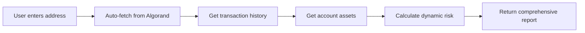
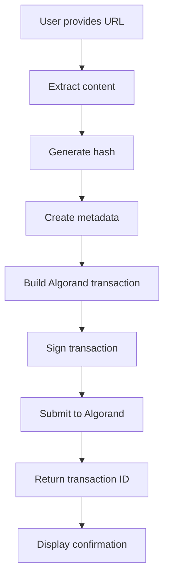

# NeuralTrust Project Rewrite Plan

## Project Vision

**NeuralTrust** is a comprehensive blockchain risk management and asset protection platform built on Algorand. The platform provides:

1. **Dynamic Risk Analysis** - AI-powered fraud detection with minimal user input
2. **Asset Protection** - Secure document/certificate registration on Algorand blockchain

---

## Phase 1: Core Risk Management System

### 1.1 Simplified Analysis - Minimum Input, Maximum Output

**Current Problem:** Too many required fields for analysis

**Solution:** Single address input with automatic data enrichment



**New Analysis Request:**
```json
{
  "address": "FR3DXSMXLGF7QOEYMYSYN3RV3UNFEYEK2RF2P3PAXXTKFNRASPRFADPD34"
}
```

**New Analysis Response:**
```json
{
  "address": "FR3DXSMXLGF7QOEYMYSYN3RV3UNFEYEK2RF2P3PAXXTKFNRASPRFADPD34",
  "risk_score": 35,
  "risk_level": "LOW",
  "recommendation": "ALLOW",
  "funds": {
    "algo_balance": 1.0,
    "assets_count": 0,
    "total_value_usd": 0.15
  },
  "transaction_summary": {
    "total_transactions": 1,
    "total_volume": 10.0,
    "unique_counterparties": 1,
    "first_transaction": "2026-02-14"
  },
  "risk_factors": {
    "account_age": {"score": 30, "status": "new_account"},
    "transaction_frequency": {"score": 25, "status": "low_activity"},
    "counterparty_diversity": {"score": 40, "status": "limited"},
    "value_patterns": {"score": 20, "status": "normal"}
  },
  "flags": [],
  "suggestions": [
    "New account - monitor initial transactions",
    "Consider setting up vault protection"
  ]
}
```

### 1.2 Algorand AlgoKit Integration

**Files to Create/Modify:**
- `projects/backend/app/services/algorand_service.py` - AlgoKit integration
- `projects/backend/app/core/algorand_config.py` - Network configuration

**AlgoKit Features to Use:**
- Smart contract deployment
- Transaction building
- Account management
- Asset operations

### 1.3 RAG-Style Chatbot

**Purpose:** Answer questions about the project, blockchain, and user accounts

**Knowledge Base:**
- Project documentation
- Algorand blockchain concepts
- Risk management best practices
- User account data (real-time)

**Implementation:**
```python
class RAGChatbot:
    def __init__(self):
        self.knowledge_base = [
            "NeuralTrust is a blockchain risk management platform",
            "We use Algorand for secure transactions",
            "Risk scores range from 0-100",
            "Vault protection freezes assets when risk threshold exceeded",
            # ... more context
        ]
    
    async def answer(self, question: str, user_address: str = None):
        # 1. Search knowledge base
        # 2. Fetch user data if relevant
        # 3. Build context-aware prompt
        # 4. Return AI response
```

### 1.4 Freeze Functionality

**API Endpoints:**
- `POST /api/vault/freeze` - Freeze vault
- `POST /api/vault/unfreeze` - Unfreeze vault
- `GET /api/vault/status` - Check freeze status

**Freeze Triggers:**
- Manual user action
- Risk threshold exceeded
- Suspicious activity detected

### 1.5 Fund Checking in Profile

**Profile Section Features:**
- ALGO balance
- Asset holdings
- Transaction history
- Risk history graph
- Vault status

### 1.6 Asset URL Blocking

**Purpose:** Block suspicious asset URLs

**Implementation:**
- Maintain blocked URL database
- Check URLs in transactions
- Warn users about blocked assets

---

## Phase 2: Asset Protection Module

### 2.1 Module Structure

```
projects/asset_protection/
├── __init__.py
├── services/
│   ├── asset_service.py        # Core asset operations
│   ├── embedding_service.py    # URL content extraction
│   ├── blockchain_service.py   # Algorand integration
│   └── verification_service.py # Asset verification
├── models/
│   ├── asset.py               # Asset data models
│   └── certificate.py         # Certificate models
├── api/
│   └── routes.py              # API endpoints
├── templates/
│   ├── protect.html           # Asset protection UI
│   ├── my_assets.html         # User assets list
│   └── verify.html            # Asset verification
└── static/
    └── js/asset_protection.js # Frontend logic
```

### 2.2 Asset Protection Flow



### 2.3 Supported Asset Types

| Type | Extensions | Extraction Method |
|------|------------|-------------------|
| Documents | .pdf, .doc, .docx | Text extraction + hash |
| Images | .jpg, .png, .gif | Image hash + metadata |
| Certificates | .pdf, .json | Full content hash |
| Credit Files | .pdf, .csv | Structured data hash |
| Code | .py, .js, .sol | Source code hash |

### 2.4 URL Embedding Service

```python
class EmbeddingService:
    async def extract_content(self, url: str) -> dict:
        # 1. Fetch URL content
        # 2. Detect content type
        # 3. Extract relevant data
        # 4. Generate content hash
        # 5. Create preview
        
        return {
            "url": url,
            "content_type": "pdf",
            "content_hash": "sha256:abc123...",
            "preview": "base64...",
            "metadata": {
                "title": "Document Title",
                "author": "Author Name",
                "created": "2026-02-14"
            }
        }
```

### 2.5 Algorand Block Creation

**Transaction Structure:**
```python
asset_transaction = {
    "type": "appl",  # Application call
    "app_id": ASSET_PROTECTION_APP_ID,
    "app_args": [
        "register_asset",
        content_hash,
        asset_type,
        metadata_json
    ],
    "note": json.dumps({
        "action": "asset_protection",
        "url": original_url,
        "timestamp": datetime.utcnow().isoformat()
    })
}
```

### 2.6 API Endpoints

| Endpoint | Method | Description |
|----------|--------|-------------|
| `/api/assets/protect` | POST | Register new asset |
| `/api/assets/verify` | POST | Verify asset authenticity |
| `/api/assets/my` | GET | List user assets |
| `/api/assets/{id}` | GET | Get asset details |
| `/api/assets/{id}/history` | GET | Get asset history |

### 2.7 Asset Protection Request

```json
{
  "url": "https://example.com/certificate.pdf",
  "asset_type": "certificate",
  "metadata": {
    "title": "University Degree Certificate",
    "issuer": "University Name",
    "recipient": "Student Name"
  }
}
```

### 2.8 Asset Protection Response

```json
{
  "asset_id": "12345678",
  "transaction_id": "ABC123...",
  "content_hash": "sha256:def456...",
  "registered_at": "2026-02-14T17:00:00Z",
  "algorand_explorer": "https://testnet.algoexplorer.io/tx/ABC123...",
  "verification_url": "https://neuraltrust.app/verify/12345678",
  "status": "protected"
}
```

---

## UI Updates

### Dashboard Enhancements
- Quick analysis input (single address field)
- Risk score visualization
- Fund summary widget
- Recent alerts panel

### New Pages
- `/protect` - Asset protection page
- `/my-assets` - User assets dashboard
- `/verify` - Asset verification page

### Profile Section
- Fund balance display
- Asset holdings list
- Risk history chart
- Vault controls (freeze/unfreeze)

---

## Implementation Order

### Sprint 1: Core Risk Management
1. Simplify analysis API
2. Add fund checking
3. Implement freeze functionality
4. Add RAG chatbot context

### Sprint 2: AlgoKit Integration
1. Set up AlgoKit project structure
2. Deploy smart contracts
3. Integrate with backend

### Sprint 3: Asset Protection Module
1. Create module structure
2. Implement URL embedding
3. Build Algorand integration
4. Create UI pages

### Sprint 4: UI Polish
1. Update dashboard
2. Add profile section
3. Create asset protection UI
4. Add verification UI

---

## Technical Requirements

### Dependencies to Add
```
algokit-utils>=1.0.0
py-algorand-sdk>=2.0.0
beautifulsoup4>=4.12.0
pypdf>=3.0.0
pillow>=10.0.0
```

### Environment Variables
```
ALGORAND_NETWORK=testnet
ALGORAND_NODE_URL=https://testnet-api.algonode.cloud
ALGORAND_INDEXER_URL=https://testnet-idx.algonode.cloud
ASSET_PROTECTION_APP_ID=12345678
```

---

## Success Metrics

1. **Analysis Speed:** < 2 seconds for full risk report
2. **Asset Registration:** < 5 seconds to create Algorand block
3. **User Satisfaction:** Minimal input, comprehensive output
4. **Security:** All assets verifiable on Algorand blockchain
